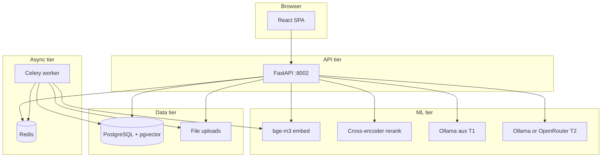

# JurisGuard V2 — Complete Project Handoff & Interview Guide

**Version:** 1.0  
**Date:** June 2026  
**Audience:** You (the builder), new engineers, interviewers, future you  
**Purpose:** Explain this project so someone with **zero prior context** can understand what it is, why it was built this way, how it works under the hood, and defend every major decision in an interview or on a CV.

---

## Table of contents

1. [30-second elevator pitch](#1-30-second-elevator-pitch)
2. [CV-ready bullets (copy/paste)](#2-cv-ready-bullets-copypaste)
3. [The problem in plain English](#3-the-problem-in-plain-english)
4. [What you actually built](#4-what-you-actually-built)
5. [Architecture at a glance](#5-architecture-at-a-glance)
6. [Technology choices — and WHY](#6-technology-choices--and-why)
7. [Under the hood: how a chat answer is produced](#7-under-the-hood-how-a-chat-answer-is-produced)
8. [Under the hood: document upload → searchable knowledge](#8-under-the-hood-document-upload--searchable-knowledge)
9. [Feature guide: why each exists and how it works](#9-feature-guide-why-each-exists-and-how-it-works)
10. [Security, compliance, and enterprise controls](#10-security-compliance-and-enterprise-controls)
11. [Testing and measured quality](#11-testing-and-measured-quality)
12. [Deployment profiles (dev vs air-gap)](#12-deployment-profiles-dev-vs-air-gap)
13. [Repository map for onboarding](#13-repository-map-for-onboarding)
14. [Interview defense playbook](#14-interview-defense-playbook)
15. [Pitch scripts (2 / 5 / 20 minutes)](#15-pitch-scripts-2--5--20-minutes)
16. [Honest limitations (say these out loud)](#16-honest-limitations-say-these-out-loud)
17. [Glossary](#17-glossary)

---

## 1. 30-second elevator pitch

> **JurisGuard V2** is an **on-premise legal intelligence platform** for EU teams. It lets lawyers and DPOs ask questions about **GDPR, BGB, and their own contract documents** and get **grounded answers with citations** — without sending client data to public cloud LLMs like ChatGPT. It includes matter workspaces, contract analysis, regulatory gap reports, enterprise SSO, legal hold, and a **tamper-evident audit log**. The stack is FastAPI + PostgreSQL/pgvector + React, with a hybrid RAG pipeline (vector + keyword search + reranking) and swappable LLM backends (OpenRouter for dev, Ollama for air-gap production).

---

## 2. CV-ready bullets (copy/paste)

Use 3–5 of these depending on role (backend, ML, full-stack, platform):

- **Designed and built JurisGuard V2**, an on-prem legal AI platform (FastAPI, PostgreSQL/pgvector, React) serving GDPR/BGB research chat, matter-scoped contract Q&A, and DPO gap-analysis workflows for EU compliance teams.
- **Implemented production hybrid RAG pipeline**: bge-m3 embeddings, BM25+vector fusion (RRF), cross-encoder reranking, adaptive HyDE, CRAG-lite query rewrite, citation verification, and extractive fallback when LLM ignores context.
- **Shipped enterprise controls**: multi-tenant org isolation (optional Postgres RLS), SAML/OIDC/SCIM SSO, legal hold, SHA-256 hash-chained WORM audit with verify API, JWT refresh rotation, RBAC + document confidentiality tiers.
- **Built async document ingest** (Celery/Redis): PDF/DOCX/TXT/OCR pipeline, hierarchical chunking, contextual retrieval metadata, optional contract knowledge-graph extraction.
- **Created eval harness** with golden logical tests (109 API cases), RAGAS proxy metrics, latency SLOs; measured **99.1% logical pass** (OpenRouter dev) and **79.8%** (Ollama phi3.5 air-gap, CUDA).
- **Delivered full React SPA**: streaming research chat, matters workspace, contract editor with version history, audit export, admin/corpus management, Playwright E2E suite.
- **Packaged air-gap deployment**: Docker Compose profiles, GPU stack (CUDA embeddings/rerank), offline bundle script, compliance control matrix for SOC 2 / ISO procurement.

**Skills to tag:** Python, FastAPI, PostgreSQL, pgvector, Redis, Celery, React, RAG/LLM orchestration, Docker, OAuth/SAML/SCIM, GDPR-aware system design, pytest, Playwright.

---

## 3. The problem in plain English

Imagine you work at a **German law firm** or as a **Data Protection Officer (DPO)**:

| Pain | Why generic AI fails |
|------|----------------------|
| "What does GDPR Art. 6 allow?" | ChatGPT hallucinates articles, mixes jurisdictions, gives no audit trail |
| "Does this NDA deviate from our standard?" | You can't upload client contracts to a US SaaS without breach of professional secrecy |
| "Prove who accessed this matter in March" | Consumer chat tools have no legal hold, no immutable logs, no org isolation |
| "Pass our security review" | No SSO, no SCIM, no control matrix → procurement stalls 3–6 months |

**JurisGuard's bet:** Build **Harvey-like legal workflows** (research, analyze, compare, gap reports) but **self-hosted in the customer's VPC**, with **every answer tied to retrieved sources** and **every action logged in a hash chain**.

---

## 4. What you actually built

JurisGuard V2 is **not** a chat wrapper around GPT. It is a **full product**:

```
┌─────────────────────────────────────────────────────────────┐
│  React UI (Research, Matters, Graph, Audit, Admin, Help)    │
└───────────────────────────┬─────────────────────────────────┘
                            │ REST + SSE
┌───────────────────────────▼─────────────────────────────────┐
│  FastAPI API (20+ router modules, JWT auth, rate limits)    │
├─────────────────────────────────────────────────────────────┤
│  Services: RAG, embeddings, reranker, LLM client, audit,    │
│  export PDF, graph extract, gap workflow, playbook, security  │
└───────┬───────────────────────────────┬─────────────────────┘
        │                               │
┌───────▼────────┐              ┌───────▼────────┐
│  Celery worker │              │  PostgreSQL    │
│  (ingest, OCR, │              │  + pgvector    │
│   gap jobs)    │              │  + audit chain │
└───────┬────────┘              └────────────────┘
        │
┌───────▼────────┐     ┌─────────────────┐
│  Redis queue   │     │  Ollama /       │
└────────────────┘     │  OpenRouter LLM │
                       └─────────────────┘
```

**Phases delivered (1–10):**
- **1–5:** Core RAG, law corpus, matters, analyze/compare, eval gates
- **6–8:** React UI, streaming, exports, RBAC surfaces, deploy hardening
- **9:** Enterprise (org isolation, legal hold, SSO/SCIM, gap agent, WORM audit, contract editor, compliance pack)
- **10:** Production polish (OCR, clause library, GPU profile, air-gap bundle, brutal gate CI)

---

## 5. Architecture at a glance

### 5.1 The four model tiers (T0–T3)

This is the **central design decision**. Not everything runs through one big LLM.

| Tier | What | Always local? | Why separate |
|------|------|---------------|--------------|
| **T0** | bge-m3 embeddings + cross-encoder reranker + Postgres full-text | Yes | Retrieval quality must not depend on external APIs; embeddings are deterministic and cacheable |
| **T1** | Small Ollama model (qwen2.5:0.5b) — HyDE, query decompose, graph extract | Yes in air-gap | Cheap aux tasks; don't burn the big model on "write a fake paragraph for search" |
| **T2** | Main LLM — phi-4-mini (OpenRouter) or phi3.5 (Ollama) | Configurable | Answer generation; swappable without code changes |
| **T3** | Extractive fallback — pick best context chunk, no LLM | Yes | Safety net when T2 refuses or ignores sources |

**Interview line:** *"We tiered models by cost, latency, and data residency — retrieval stays local even when generation uses a cloud API in dev."*

### 5.2 System topology



### 5.3 Two corpora, one retrieval engine

| Corpus | Content | Scoped by |
|--------|---------|-----------|
| **Law corpus** | GDPR, BGB, BDSG, EU AI Act chunks (~1,850+ in dev) | Global; same for all orgs |
| **Matter corpus** | Uploaded NDAs, DPAs, MSAs per deal | `org_id`, `matter_id`, confidentiality tier |

The **same hybrid search code** (`vector_store.py`) serves both; filters differ per request.

---

## 6. Technology choices — and WHY

| Choice | Alternative considered | Why we picked it |
|--------|------------------------|------------------|
| **FastAPI** | Django, Flask | Async-native, OpenAPI auto-gen, Pydantic validation, fast to ship REST+SSE |
| **PostgreSQL + pgvector** | Pinecone, Weaviate, Qdrant | Single DB for relational + vectors + audit; air-gap friendly; no extra vendor |
| **Hybrid search (vector + BM25 + RRF)** | Vector-only | Legal queries use exact article numbers ("Art. 6", "§ 433"); keyword leg is critical |
| **Cross-encoder reranker** | LLM rerank | 20→5 candidates in ~100ms CPU; cheaper than asking LLM to score chunks |
| **Celery + Redis** | In-process background tasks | Ingest can take minutes; API must return immediately; horizontal worker scaling |
| **bge-m3 (1024-d)** | OpenAI ada, jina | Strong multilingual (DE/EN law), runs fully offline, no API key |
| **Ollama for air-gap** | vLLM, llama.cpp direct | Simple ops for pilots; `LLM_PROVIDER=ollama` flip with zero code change |
| **OpenRouter for dev** | Direct OpenAI | Fast iteration, model swap via env var, keeps air-gap path testable separately |
| **React + Vite** | Next.js | SPA behind corporate reverse proxy; no SSR complexity for on-prem |
| **JWT + refresh rotation** | Session cookies only | Stateless API scaling; refresh tokens revocable from admin |
| **Hash-chained audit** | Plain append log | Detect tampering; DPO/regulator story; `GET /audit/verify` |
| **Bounded gap workflow** | Open ReAct agent | Predictable cost (max 12 LLM calls), no runaway tool loops, auditable steps |

---

## 7. Under the hood: how a chat answer is produced

When a user asks *"What are the GDPR lawful bases in Article 6?"*, this happens:

### Step 0 — Gatekeeping
1. **JWT validated** (`deps.py`) — user id, org id, role extracted.
2. **Rate limit** checked (`chat.py` — 10/min; dev master exempt for eval).
3. **Prompt injection guard** (`services/security.py`) — regex + sentinel patterns; blocks or sanitizes jailbreaks.
4. **Query guard** — rejects empty/trivial queries.

### Step 1 — Cache check
- Redis cache keyed by normalized query (`query_cache.py`).
- Law Q&A repeats are common; cache saves full RAG+LLM cost.

### Step 2 — Query enhancement
- **Legal query expansion** — synonyms, article normalization (`query_enhance.py`).
- **Adaptive HyDE** (optional) — T1 aux model writes a *hypothetical* legal paragraph to improve embedding search (`hyde.py`). Only used when query is vague; skipped for exact article lookups (saves latency).

### Step 3 — Retrieval
1. **Embed** the query with bge-m3 (`embeddings.py`).
2. **Vector search** — pgvector HNSW, top ~20 chunks.
3. **BM25 full-text search** — Postgres `tsvector`, top ~20 chunks.
4. **RRF merge** — Reciprocal Rank Fusion combines both lists (`rrf.py`).
5. **Section boost** — if query mentions "§ 433", chunks containing that section float up (`rag.py`).
6. **Cross-encoder rerank** — ms-marco MiniLM scores query–chunk pairs; keep top 5 (`reranker.py`).

### Step 4 — Extra context
- **DLG (Document Link Graph)** for law — deterministic edges between related articles (`corpus/dlg`).
- **Contract graph** for matter docs — entities/relationships extracted at ingest (optional).

### Step 5 — Generation
- Build prompt: system instructions + top chunks + user question.
- Call **T2 LLM** (`llm_client.py` → Ollama HTTP or OpenRouter API).
- If LLM output **ignores context** (word overlap check) or **refuses generically** → **T3 extractive fallback** picks the best matching chunk verbatim.

### Step 6 — Verification & response
- **Citation verifier** checks answer against source chunks (`citation_verifier.py`).
- **Low-confidence flag** if rerank scores are weak.
- **Audit event** appended with SHA-256 hash chain (`audit_chain.py`).
- Return JSON or **SSE stream** to UI.

**Total latency:**
- Dev (OpenRouter phi-4-mini): **~11–17s p95**
- Air-gap (Ollama phi3.5, RTX 4050 CUDA): **~3 min p95**

---

## 8. Under the hood: document upload → searchable knowledge

```
User uploads NDA.pdf to Matter "Acme Deal"
        │
        ▼
POST /api/v1/matters/{id}/documents
        │
        ├── Save file to disk
        ├── Create matter_documents row (status: pending)
        └── Enqueue Celery task → Redis
                │
                ▼
        Worker picks up process_document_task
                │
                ├── Parse: PDF/DOCX/TXT (Tesseract OCR if scanned)
                ├── hierarchical_chunk() — parent/child sections
                ├── embed_texts() — bge-m3 per chunk
                ├── insert_chunk() — pgvector + metadata:
                │     org_id, matter_id, confidentiality, document_id
                ├── Optional: graph_extractor.py → nodes/edges
                └── Set ingest_status = "ready"
                │
                ▼
User polls GET .../documents/{id}/status → "ready"
                │
                ▼
POST .../analyze or .../compare scopes retrieval to this doc
```

**Why async?** A 50-page PDF might produce 200 chunks × embedding time. Blocking the API thread would timeout HTTP clients.

**Confidentiality tiers** (`internal` / `restricted` / `privileged`) are stamped on chunks. RBAC rules (`access_control.py`) filter what each role can retrieve.

---

## 9. Feature guide: why each exists and how it works

### 9.1 Research Chat
| | |
|---|---|
| **Problem** | Lawyers repeat the same regulatory lookups |
| **How** | Global law corpus RAG + streaming UI |
| **Key files** | `routers/chat.py`, `services/rag.py`, `ChatView.jsx` |
| **Defend** | "Every answer includes source chunks with scores; we verify citations post-generation" |

### 9.2 Matters Workspace
| | |
|---|---|
| **Problem** | Deals are siloed; docs must not leak across clients |
| **How** | `matters` table, per-matter uploads, member roles (owner/editor/viewer) |
| **Key files** | `routers/matters.py`, `MattersView.jsx` |
| **Defend** | "Retrieval filters on org_id + matter_id at the vector layer, not just the router" |

### 9.3 Document Analyze
| | |
|---|---|
| **Problem** | "What does clause 7 say about liability cap?" on a specific contract |
| **How** | Scoped RAG over one document's chunks + structured analysis schema |
| **Key files** | `POST .../analyze`, `services/structured_analysis.py` |
| **Defend** | "Analyze never searches the whole corpus — only the uploaded doc plus optional law corpus for compare mode" |

### 9.4 Baseline Compare
| | |
|---|---|
| **Problem** | "Does this DPA meet GDPR processor requirements?" |
| **How** | Retrieves law corpus + matter doc; dedicated compare prompt with decomposed sub-questions |
| **Key files** | `POST .../compare`, `query_decompose.py` |
| **Defend** | "Compare decomposes the question into law lookup + contract check — two retrieval passes" |

### 9.5 Regulatory Gap Analysis (Phase 9D)
| | |
|---|---|
| **Problem** | DPOs need a structured gap report, not open-ended chat |
| **How** | **Bounded agent** — fixed tool chain: extract obligations → search law → compare → report. Max 12 LLM calls. Redis job polling. |
| **Key files** | `routers/workflows.py`, `worker/gap_analysis.py` |
| **Defend** | "We rejected open ReAct agents for cost predictability and auditability — every step is logged" |

### 9.6 Knowledge Graph
| | |
|---|---|
| **Problem** | Visual exploration of contract entities and law cross-refs |
| **How** | Contract: LLM extraction at ingest. Law: deterministic DLG bootstrap. |
| **Key files** | `graph_extractor.py`, `GraphView.jsx`, `POST .../graph-extract` |
| **Defend** | "Graph supplements retrieval — it's not the primary search path; hybrid RAG remains source of truth" |

### 9.7 Contract Editor (Phase 9F)
| | |
|---|---|
| **Problem** | Counsel wants to edit contract text in-app, not download/re-upload |
| **How** | `document_versions` table, in-browser editor, DOCX export |
| **Key files** | `routers/contracts.py`, `ContractEditor.jsx` |
| **Defend** | "Version history is audit-logged; legal hold blocks destructive ops" |

### 9.8 Clause Library
| | |
|---|---|
| **Problem** | Reusable standard clauses across matters |
| **How** | CRUD + compare-clause API against uploaded text |
| **Key files** | `routers/clause_library.py`, `ClauseLibraryView.jsx` |

### 9.9 Chat Threads & Export
| | |
|---|---|
| **Problem** | Research sessions must persist; counsel needs PDF memos |
| **How** | `chat_threads`/`chat_messages`; PDF export with legal memo layout (no markdown artifacts) |
| **Key files** | `routers/threads.py`, `export_reports.py`, `ExportModal.jsx` |

### 9.10 Audit Log (WORM)
| | |
|---|---|
| **Problem** | Regulators ask "who did what when"; logs must not be silently edited |
| **How** | Each `audit_events` row includes `prev_hash` + `row_hash` (SHA-256 chain). Daily seal API. CSV export. |
| **Key files** | `services/audit_chain.py`, `routers/audit.py`, `AuditView.jsx` |
| **Defend** | "`GET /audit/verify` recomputes the chain — any tamper breaks the hash link" |

### 9.11 Legal Hold (Phase 9B)
| | |
|---|---|
| **Problem** | eDiscovery — must not delete data under investigation |
| **How** | `legal_holds` table; delete/export/erasure returns **409 Conflict** while hold active |
| **Key files** | `routers/legal_hold.py` |

### 9.12 SSO / SCIM (Phase 9C)
| | |
|---|---|
| **Problem** | Enterprise buyers require IdP login and automated user provisioning |
| **How** | SAML + OIDC routers; SCIM 2.0 for create/update/deactivate users |
| **Key files** | `routers/saml.py`, `oidc.py`, `scim.py`, `AuthCallback.jsx` |
| **Defend** | "Password login can be disabled per org; SCIM sets role and org membership" |

### 9.13 Admin & Corpus Management
| | |
|---|---|
| **Problem** | Ops needs to see system health, manage users, upload law snippets |
| **How** | Admin router, corpus stats, optional corpus admin upload/re-ingest |
| **Key files** | `AdminView.jsx`, `CorpusView.jsx`, `SystemView.jsx` |

### 9.14 Eval Harness
| | |
|---|---|
| **Problem** | Can't ship legal AI without regression gates |
| **How** | Golden JSONL cases (law Q&A, contract Q&A, RBAC, injection), RAGAS proxy, latency SLOs |
| **Key files** | `eval/golden/`, `scripts/run_logical_eval.py`, `make eval-ollama-full` |
| **Defend** | "109 API logical cases check substring presence in answers — catches retrieval regressions without human labelers" |

---

## 10. Security, compliance, and enterprise controls

### Authentication flow
```
Login → access_token (15 min) + refresh_token (7 days, rotatable)
      → Bearer header on all API calls
      → Middleware sets optional RLS session var (app.org_id)
```

### RBAC model
| Role | Typical powers |
|------|----------------|
| **owner** | Org admin, matter create, user invite |
| **member** | Use matters shared with them |
| **viewer** | Read-only on shared matters |

Plus **matter-level roles** (owner/editor/viewer) for collaboration.

### Confidentiality
Documents tagged `internal` / `restricted` / `privileged`. Junior roles cannot retrieve `privileged` chunks even if they guess the API.

### Compliance artifacts (not certification)
| Artifact | Location |
|----------|----------|
| Control matrix (SOC 2 mapping) | `docs/compliance/CONTROL_MATRIX.md` |
| Disaster recovery template | `docs/DISASTER_RECOVERY.md` |
| GDPR erasure process | `docs/GDPR_ERASURE.md` |
| Evidence bundle script | `scripts/compliance_evidence.sh` |

**Say in interviews:** "We built **readiness** for SOC 2/ISO — control matrix, DR template, hash-chained audit. We are **not** certified; certification is a 3–12 month process track with auditors."

---

## 11. Testing and measured quality

### Automated test suites

| Suite | What it proves | Command |
|-------|----------------|---------|
| **Unit (100+)** | Pure logic: RBAC matrix, injection patterns, hash chain, parsers | `make test-unit` |
| **Integration (50+)** | DB + API: org isolation, legal hold, SSO, WORM verify | `make test-integration` |
| **E2E API (43)** | Full HTTP flows against running stack | `make e2e` |
| **Playwright UI** | Login, chat, matters, export buttons | `make ui-e2e` |
| **Brutal gate** | Combined CI gate script | `make brutal-gate` |

### Eval metrics (June 2026)

#### Development profile (OpenRouter phi-4-mini)
| Metric | Result |
|--------|--------|
| Logical offline | 20/20 (100%) |
| Logical API | 107/109 (99.1%) |
| RAGAS proxy faithfulness | 0.87 |
| Chat latency p95 | ~16.6s |

#### Air-gap profile (Ollama phi3.5, CUDA embed/rerank)
| Metric | Result |
|--------|--------|
| Logical offline | 20/20 (100%) |
| Logical API | **87/109 (79.8%)** |
| Substring hit rate (law Q&A) | **95.6%** |
| RAGAS proxy (15 cases, complete) | faithfulness 1.0, coverage 15/15 |
| Chat latency p95 | **~183s (~3 min)** |

**How to explain the gap:** OpenRouter uses a stronger instruct model with faster inference. Ollama phi3.5 on a 6GB GPU is the **honest air-gap baseline** — good retrieval (95.6% substring hits), weaker on edge cases (refusals, cross-corpus). Contract QA in the last run failed on **ingest timeout**, not LLM quality.

Full report: `eval/reports/ollama_eval_summary_latest.json`

---

## 12. Deployment profiles (dev vs air-gap)

### Development — fast iteration
```env
LLM_PROVIDER=openrouter
OPENROUTER_MODEL=microsoft/phi-4-mini-instruct
OLLAMA_AUX_MODEL=qwen2.5:0.5b
```
```bash
cd v2 && make up && make migrate
make ui-dev    # http://localhost:5173
make eval-logical
```

### Air-gap — production pilot
```env
LLM_PROVIDER=ollama
OLLAMA_MODEL=phi3.5
OPENROUTER_API_KEY=          # empty — no external calls
RLS_ENABLED=true
REGISTRATION_OPEN=false      # SCIM-only provisioning
```
```bash
make up-gpu                  # CUDA embeddings + rerank
make airgap-bundle           # offline tarball for customer site
make eval-ollama-full        # full eval with summary JSON
```

### Ports
| Service | Port |
|---------|------|
| API | 8002 |
| Postgres | 5433 |
| Redis | 6380 |
| Ollama | 11434 |
| UI dev | 5173 |

---

## 13. Repository map for onboarding

```
v2/
├── backend/src/
│   ├── main.py              # FastAPI app, middleware, router mount
│   ├── routers/             # 20 HTTP modules (chat, matters, audit, sso…)
│   ├── services/
│   │   ├── rag.py           # ★ Core RAG orchestration
│   │   ├── vector_store.py  # Hybrid search + org filters
│   │   ├── embeddings.py    # bge-m3
│   │   ├── reranker.py      # Cross-encoder
│   │   ├── llm_client.py    # T2 provider abstraction
│   │   ├── audit_chain.py   # Hash chain
│   │   └── export_reports.py# PDF memos
│   ├── worker.py            # Celery ingest + gap jobs
│   └── alembic/versions/    # 18 DB migrations
├── frontend/src/
│   ├── App.jsx              # Shell + routing
│   └── components/          # ChatView, MattersView, GraphView…
├── eval/
│   ├── golden/              # JSONL test cases
│   └── reports/             # Latest metrics JSON
├── scripts/
│   ├── run_logical_eval.py
│   ├── run_ollama_eval_complete.sh
│   └── compliance_evidence.sh
├── docs/
│   ├── COMPLETE_PROJECT_HANDOFF.md   # ← this file
│   ├── PROJECT_MASTER_HANDOFF.md     # Business/investor summary
│   └── PHASE_9_ENTERPRISE_PLAN.md
├── docker-compose.yml
├── docker-compose.gpu.yml
├── ARCHITECTURE.md
└── Makefile
```

**Legacy note:** V1 was removed from the repo. All code is under `v2/`.

---

## 14. Interview defense playbook

### "What is JurisGuard?"
An on-prem legal intelligence platform: grounded RAG over GDPR/BGB and client documents, with enterprise audit, SSO, and legal hold — for EU teams who cannot use cloud AI on client data.

### "Why not just use ChatGPT / Harvey?"
- **Data residency:** Client contracts stay in customer VPC.
- **Grounding:** Every answer tied to retrieved chunks with citation verify.
- **Audit:** Hash-chained log, legal hold, export for regulators.
- **Harvey** is cloud SaaS; we compete on **self-hosted EU compliance**, not feature parity.

### "Explain your RAG pipeline."
Hybrid retrieval (vector + BM25, RRF merge) → cross-encoder rerank top 5 → optional HyDE/decompose on aux model → T2 generation → citation verify → extractive fallback if LLM ignores context.

### "Why pgvector instead of a vector DB?"
Single operational surface for air-gap: one Postgres handles users, matters, chunks, vectors, audit. No extra network hop or vendor. HNSW index gives sufficient performance at our corpus scale (~2k law chunks + matter docs).

### "How do you prevent hallucinations?"
1. Retrieve before generate — LLM only sees top chunks.
2. Citation verifier post-check.
3. Extractive fallback if answer doesn't overlap context.
4. Refusal path when retrieval confidence is low.
5. Eval gate: 109 golden cases must contain expected legal substrings.

### "How do you handle prompt injection?"
Layer 2 regex in `security.py` before LLM; blocked requests return 400; safe refusal phrases expected in eval golden set.

### "Multi-tenancy?"
`org_id` on matters, documents, chunks, threads. Vector search filters by org. Optional Postgres RLS (`SET LOCAL app.org_id`). Integration tests assert cross-org 404.

### "What was the hardest engineering problem?"
**Profile parity:** Same codebase must run fast in dev (OpenRouter) and fully offline in production (Ollama + local embeddings), with one env flip and the same eval harness catching regressions on both.

### "What would you improve next?"
1. Custom fine-tuned legal model (QLoRA → GGUF → Ollama).
2. Fix contract ingest timeout in eval (longer worker SLA for large fixtures).
3. Native RAGAS with judge LLM (proxy metrics are good but not industry-standard).
4. Pen test + formal SOC 2 audit.

---

## 15. Pitch scripts (2 / 5 / 20 minutes)

### 2 minutes
"I built JurisGuard — an on-prem legal AI platform for EU DPOs and in-house counsel. It answers GDPR and BGB questions with citations from an indexed law corpus, and analyzes uploaded contracts in isolated matter workspaces. The stack is FastAPI, PostgreSQL with pgvector, and React. Retrieval is hybrid vector plus keyword search with reranking; generation runs on Ollama in air-gap or OpenRouter in dev. Enterprise features include SSO, legal hold, and a tamper-evident audit hash chain. We gate quality with 109 automated golden tests — 99% pass on dev, 80% on local Ollama, with 95% retrieval substring hit rate."

### 5 minutes
Add: model tier explanation (T0–T3), walk through upload→ingest→analyze flow, mention gap analysis bounded agent, show eval JSON numbers, explain why on-prem matters for Art. 28 GDPR processor anxiety.

### 20 minutes
Add: live demo path (login → research chat → upload NDA → analyze → export PDF → audit verify), architecture diagram, SSO story, compliance pack, honest gaps (no SOC 2 cert yet, 3 min chat latency on small GPU).

---

## 16. Honest limitations (say these out loud)

| Limitation | Reality |
|------------|---------|
| Not SOC 2 / ISO certified | Control matrix exists; certification is a process, not a checkbox |
| Air-gap latency | ~3 min/chat on RTX 4050 + phi3.5 — usable for research, not real-time chat UX |
| No Word tracked-changes redline | Contract editor + DOCX export yes; OOXML redline is backlog |
| RAGAS "100%" on Ollama run | Proxy metric on 15-case subset with substring matching — not native RAGAS with GPT judge |
| Fine-tuned legal model | Not in production; phi3.5/general models are the air-gap default |
| Harvey / Legora parity | Different market: we win on-prem + audit + EU law corpus, not cloud UX polish |

**Credibility rule:** Interviewers trust you more when you name limits before they ask.

---

## 17. Glossary

| Term | Meaning |
|------|---------|
| **RAG** | Retrieval-Augmented Generation — fetch relevant docs first, then ask LLM |
| **HyDE** | Hypothetical Document Embeddings — aux LLM writes fake paragraph to improve search |
| **RRF** | Reciprocal Rank Fusion — merge two ranked lists (vector + keyword) |
| **Reranker** | Cross-encoder that scores (query, chunk) pairs more accurately than bi-encoder |
| **DLG** | Document Link Graph — deterministic edges between law articles |
| **DPO** | Data Protection Officer |
| **Matter** | A legal deal/case workspace containing documents |
| **WORM** | Write Once Read Many — immutable storage; here implemented as hash chain |
| **Legal hold** | Block deletes/exports during investigation |
| **SCIM** | System for Cross-domain Identity Management — automated user provisioning |
| **Air-gap** | Deployment with no outbound internet (local LLM only) |
| **Golden eval** | Fixed Q&A test set with expected substrings in answers |
| **CRAG-lite** | Corrective RAG — rewrite query if first retrieval is weak |

---

## Quick reference card

```
Start:     cd v2 && make up-gpu && make migrate
UI:        make ui-dev  →  http://localhost:5173
API docs:  http://localhost:8002/docs
Eval:      make eval-ollama-full
Tests:     make test-unit && make test-integration && make e2e
Summary:   eval/reports/ollama_eval_summary_latest.json
Dev login: devmaster@example.com / DevMasterPass123!  (local only)
```

---

*This document is the pedagogical companion to `PROJECT_MASTER_HANDOFF.md` (business/investor view) and `ARCHITECTURE.md` (technical quick reference). Read this one to learn the system; read the others to sell or deploy it.*

*Generated June 2026 · JurisGuard V2*
