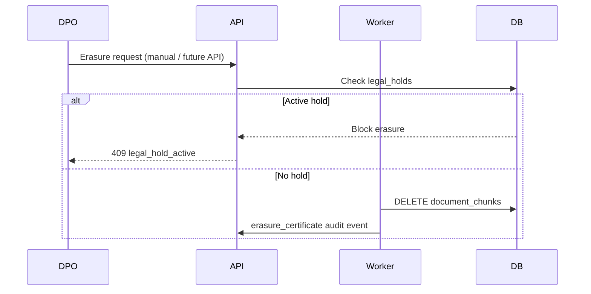

# GDPR Art. 17 — Erasure Workflow

**Phase:** 9E · **Status:** Technical implementation + DPO process template

---

## Scope

This document describes how JurisGuard V2 handles **data subject erasure requests** for:

- Vector embeddings (`document_chunks`)
- Uploaded contract files (customer decision)
- Audit trail (generally **retained** for legal obligation — document exception in contract)

---

## Technical flow

Implementation: `backend/src/worker/erasure.py`

---

## Legal hold gate

Erasure **must not** proceed when:

- Matter-level hold is active, or  
- Document-level hold is active  

Audit action: `erasure_skipped` with reason `legal_hold_active`.

---

## Erasure certificate

On successful chunk deletion, an audit event is written:

- **action:** `erasure_certificate`  
- **resource_type:** `document`  
- **details:** `{ status, document_id, chunks_deleted }`

Export via `GET /api/v1/audit/export` for DPO evidence pack.

---

## Ghost vector mitigation

After hard delete of chunks:

1. Postgres rows are removed — vectors no longer queryable  
2. For high-assurance deployments, schedule `VACUUM FULL` on `document_chunks` during maintenance window  
3. Re-ingest law corpus is independent of matter erasure  

---

## File blob erasure

Uploaded files under `data/uploads/` are **not** automatically deleted by the chunk erasure worker. DPO should:

1. Confirm no legal hold  
2. Delete DB row via standard document delete API (blocked if hold)  
3. Remove file from disk or rely on WORM retention policy  

---

## ROPA cross-reference

Customer maintains Records of Processing Activities (Art. 30) separately — see `docs/compliance/CONTROL_MATRIX.md` GDPR section.

---

## Checklist (DPO)

- [ ] Verify data subject identity  
- [ ] Identify matters/documents containing personal data  
- [ ] Check active legal holds  
- [ ] Execute erasure or document legal basis for retention  
- [ ] Export erasure certificate from audit log  
- [ ] Update ROPA / subject response log  
