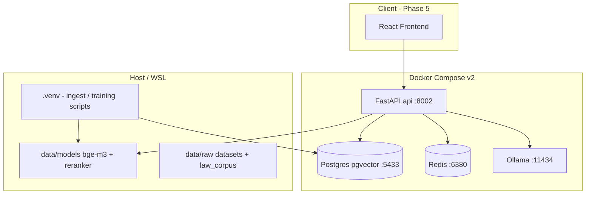

# JurisGuard V2 — Handoff Document

**Last updated:** 2026-05-27  
**Location:** `~/juris_full_project/v2/` (greenfield); V1 remains at repo root (`backend/`, `frontend/`, legacy `docker-compose.yml`).  
**Audience:** Next developer, future you, or an AI agent continuing the build.

---

## 1. Executive summary

JurisGuard V2 is an **on-premise, air-gap capable** legal intelligence platform (GDPR/BDSG positioning). It rebuilds V1 with a modern stack: **Phi-3.5-mini QLoRA** (Colab) → **Ollama GGUF** for inference; **bge-m3** embeddings and **ms-marco** reranker on CPU; **PostgreSQL + pgvector**; **Redis** (reserved for Celery); **FastAPI** backend; React frontend planned in Phase 5.

**What works today:**

| Area | Status |
|------|--------|
| Datasets + models on disk | ✅ Verified |
| Training JSONL (94k train / 10k eval) | ✅ Built |
| Local fine-tune smoke test (RTX 4050) | ✅ Passed |
| Colab fine-tune | ⏸ ~32% (~step 3800); GPU quota paused |
| Docker runtime (db, redis, ollama, api) | ✅ Running |
| JWT auth | ✅ |
| Law corpus in pgvector (GDPR + BGB) | ✅ **1,858 chunks** (host ingest) |
| RAG + chat API | ✅ Code complete; Docker ML stack needs `ensure_docker_ml_deps.py` |
| Frontend / matters / audit | 📋 Planned |

---

## 2. Environment & hardware

| Item | Value |
|------|--------|
| Machine | Victus laptop, RTX 4050 **6 GB** VRAM |
| OS | Windows 11 + **WSL2** Ubuntu |
| Visible RAM (WSL) | ~7 GB |
| Python | 3.12 (`v2/.venv`) |
| Dev URLs | API **8002**, Postgres **5433**, Redis **6380**, Ollama **11434** (avoids V1 port clashes) |

**Locked product decisions:**

- **QLoRA** for fine-tuning (not full LoRA).
- **Colab** for full 94k training; **local `phi3.5`** for app dev while GPU quota is paused.
- **Implementation order:** 2.2 auth → 2.3 corpus → 3 RAG → 4 matters → 5 frontend.
- **Do not delete** `checkpoint_RESUME/` on Drive or local training backup until training + GGUF export finish.

---

## 3. Architecture (current)



### 3.1 RAG pipeline (implemented)

1. **Embed** user question with **bge-m3** (1024-dim, normalized).
2. **Vector search** in `document_chunks` (cosine distance, pgvector).
3. **Filter** to `metadata.kind == "law"` when `use_law_corpus=true`.
4. **Rerank** top 20 → top 5 with **cross-encoder/ms-marco-MiniLM-L-6-v2** (fallback: vector order if rerank fails).
5. **Prompt** Phi-3.5 via Ollama with context + question.
6. Return **answer**, **model name**, **sources** (labels + distances).

### 3.2 Fine-tune pipeline (partial)

1. Raw datasets → instruction JSONL (`02_prepare_training_data.py`).
2. Merge + dedup → `train_final.jsonl` / `eval_set.jsonl` (`04_build_final_dataset.py`).
3. Colab notebook `phi35_legal_finetune.ipynb` — Unsloth + QLoRA, crash-safe `checkpoint_RESUME/`.
4. Export **GGUF** (Cell 8) → `ollama create` → set `OLLAMA_MODEL` in `.env`.

---

## 4. Repository layout

```
juris_full_project/
├── backend/              # V1 legacy
├── frontend/             # V1 legacy
├── docker-compose.yml    # V1 legacy
└── v2/                   # ★ All new work
    ├── .env              # gitignored — copy from .env.example
    ├── .env.example
    ├── docker-compose.yml
    ├── README.md
    ├── docs/
    │   ├── HANDOFF.md           # this file
    │   └── TRAINING_CHECKPOINTS.md
    ├── notebooks/
    │   └── phi35_legal_finetune.ipynb
    ├── deploy/
    │   └── Modelfile.example
    ├── scripts/                 # download, training, verify, ingest
    ├── data/                    # gitignored
    │   ├── raw/                 # CUAD, LEDGAR, MAUD, ContractNLI, law_corpus
    │   ├── models/              # bge-m3, reranker, phi tokenizer
    │   ├── processed/           # train_final.jsonl, eval_set.jsonl
    │   └── smoke_checkpoints/
    └── backend/
        ├── Dockerfile           # layered: base → torch cpu → ml → src
        ├── requirements-base.txt
        ├── requirements-ml.txt
        ├── alembic/
        └── src/
            ├── main.py
            ├── config.py
            ├── db.py
            ├── auth_utils.py
            ├── deps.py
            ├── schemas.py
            ├── ingest_law.py
            ├── routers/         # auth, corpus, chat
            └── services/        # embeddings, vector_store, reranker, ollama_client, rag
```

---

## 5. Data assets (Phase 0)

### 5.1 Datasets (verified on disk)

| Dataset | Path | Use |
|---------|------|-----|
| CUAD | `data/raw/cuad/` | Contract clauses Q&A |
| LEDGAR | `data/raw/ledgar/` | Legal provisions |
| ContractNLI | `data/raw/contract_nli/` | NLI / obligations |
| MAUD | `data/raw/maud/` | M&A diligence |
| GDPR (EN) | `data/raw/law_corpus/gdpr_en.txt` | RAG + reference |
| BGB (EN) | `data/raw/law_corpus/bgb_en.txt` | RAG + reference |

**Verify:** `python scripts/verify_assets.py`

### 5.2 Models

| Model | Path | Size / notes |
|-------|------|----------------|
| bge-m3 | `data/models/bge-m3/` | **pytorch_model.bin ~2.3 GB** (no `model.safetensors` in current download) |
| Reranker | `data/models/reranker/` | `model.safetensors` ~90 MB |
| Phi-3.5 (inference) | Ollama | `phi3.5` via Docker or host |
| Phi-3.5 tokenizer | `data/models/phi-3.5-mini-instruct/` | For training scripts |
| Fine-tuned weights | Colab / local backup | See §7 |

**Download:** `python scripts/download_assets.py --all` or selective `--datasets` / `--models`.

---

## 6. Features implemented (detailed)

### Phase 0 — Asset pipeline ✅

- **`download_assets.py`** — HF + HTTP downloads with retries, progress, allow-lists (skips ONNX bloat for bge-m3).
- **`verify_assets.py`** — Checks datasets, model weight files (bge ≥500MB), optional Ollama phi3.5.
- **`download_overnight.py`** — Long-running model downloads.
- **`00_verify_gpu.sh`** — CUDA visibility for local training.
- **`.env` HF_TOKEN** — Optional; never committed.

### Phase 1 — Training data ✅

- **`02_prepare_training_data.py`** — Per-dataset instruction JSONL in `data/processed/pairs/`.
- **`04_build_final_dataset.py`** — Merge, dedup, train/eval split.
- **`03_generate_synthetic.py`** — Optional Ollama-generated examples (not run in main path).
- **`verify_training_data.py`** — Phase 1 completeness checks.
- **Output:** **94,442 train** / **10,493 eval** lines in `data/processed/train_final.jsonl` and `eval_set.jsonl`.

### Phase 1.3 — Local smoke test ✅

- **`05_smoke_test_finetune.py`** — 400 examples, 30 steps, `unsloth/Phi-3.5-mini-instruct-bnb-4bit` (~2.3 GB).
- Fixes applied: TRL 1.5 `SFTConfig`, no AMP by default on 4050, resume via `--resume`.
- Artifacts: `data/smoke_checkpoints/checkpoint_RESUME/`, `final_adapter/`.

### Phase 1.4 — Colab fine-tune ⏸

- **Notebook:** `notebooks/phi35_legal_finetune.ipynb`
- **Drive layout:** `My Drive/JurisGuard/training/`
- **Resume folder:** `checkpoint_RESUME/` (do not delete)
- **Manifest:** `RUN_MANIFEST.json` (step ~3800, loss ~0.63 at pause)
- **GGUF:** `training/gguf/` **empty** until Cell 8 runs

**Local backup (WSL):**

```
/mnt/c/Users/mhamd/Desktop/PROJECT/juris/training
```

### Phase 2.1 — Runtime scaffold ✅

**Docker services:** `db`, `cache`, `ollama`, `api`

| Endpoint | Method | Auth | Description |
|----------|--------|------|-------------|
| `/health` | GET | No | Liveness |
| `/api/v1/status` | GET | No | Ollama reachability, model list, training manifest, resume checkpoint flag |

**Database (Alembic `001_initial_pgvector`):**

- Extension `vector`
- Table `document_chunks` — `embedding vector(1024)`, `metadata` JSONB, HNSW index created on ingest
- Table `users` — email, bcrypt password hash

### Phase 2.2 — Authentication ✅

| Endpoint | Method | Body | Response |
|----------|--------|------|----------|
| `/api/v1/auth/register` | POST | `email`, `password` (≥8 chars) | JWT `access_token` |
| `/api/v1/auth/login` | POST | `email`, `password` | JWT |
| `/api/v1/auth/me` | GET | Bearer token | `id`, `email`, `created_at` |

- **JWT** via `python-jose`, HS256, `AUTH_SECRET_KEY` from `.env`.
- **Passwords:** bcrypt via passlib.
- **Email validation:** Pydantic `EmailStr` — use real domains (e.g. `dev@example.com`); **`.local` fails with 422**.

### Phase 2.3 — Law corpus ✅

- **`ingest_law.py`** — Chunks GDPR/BGB (~1200 chars), embeds with bge-m3, writes to pgvector.
- **Stable document UUIDs** for gdpr / bgb (re-ingest replaces by `document_id`).
- **Stats:** `GET /api/v1/corpus/stats` → `total_chunks`, `by_source`.
- **Trigger stub:** `POST /api/v1/corpus/ingest-law` (auth) — returns CLI instructions (ingest not inline).

**Ingested counts (confirmed):**

```json
{
  "total_chunks": 1858,
  "by_source": { "bgb": 1565, "gdpr": 293 }
}
```

**Recommended ingest (host venv):**

```bash
python scripts/run_ingest_law.py
```

### Phase 3 — RAG chat ✅ (basic)

| Endpoint | Method | Auth | Body | Response |
|----------|--------|------|------|----------|
| `/api/v1/chat` | POST | Bearer | `message`, `use_law_corpus` (default true) | `answer`, `model`, `sources[]` |

**Services:**

- `services/embeddings.py` — bge-m3 with local path + `BAAI/bge-m3` fallback.
- `services/vector_store.py` — insert, search, corpus stats.
- `services/reranker.py` — cross-encoder with local + HF fallback; RAG catches rerank errors.
- `services/ollama_client.py` — Phi-3.5 chat template, model name resolution.
- `services/rag.py` — Full pipeline orchestration.

**Config (`config.py` / `.env`):**

- `RAG_TOP_K=20`, `RAG_RERANK_K=5`, `RAG_MAX_CONTEXT_CHARS=6000`
- `EMBEDDING_MODEL_PATH`, `RERANKER_MODEL_PATH`, `LAW_CORPUS_PATH`
- `OLLAMA_MODEL`, `OLLAMA_BASE_URL`

### Helper scripts (operations)

| Script | Purpose |
|--------|---------|
| `fix_sh_crlf.py` | Fix Windows CRLF on `scripts/*.sh` |
| `docker_up.py` | Start stack without bash |
| `ensure_docker_ml_deps.py` | Pin torch 2.6 + ST 3.4 + transformers 4.49 in API container |
| `run_ingest_law.py` | Host ingest (no bash) |
| `00_verify_phase23.py` | Auth + corpus + chat smoke test |
| `ingest_law_host.sh` | Host ingest wrapper |
| `create_ollama_jurisguard.sh` | Create custom Ollama model from GGUF |

---

## 7. Training checkpoint state

See **`docs/TRAINING_CHECKPOINTS.md`**.

| Item | Status |
|------|--------|
| `checkpoint_RESUME/` | Present (~step 3800) |
| Full epoch target | ~11,800 steps/epoch |
| `gguf/` | **Empty** — run notebook Cell 8 after training |
| App dev model | `OLLAMA_MODEL=phi3.5` |
| Post-GGUF | `ollama create` + `OLLAMA_MODEL=jurisguard-v1` (or `-dev`) |

**Mount training folder in Docker** (`v2/.env`):

```env
TRAINING_DIR=/mnt/c/Users/mhamd/Desktop/PROJECT/juris/training
TRAINING_MOUNT_PATH=/training
```

---

## 8. Current blockers & troubleshooting

### 8.1 Docker API ML stack (chat 500)

**Symptom:** `model.safetensors not found` or CVE `torch.load` requires torch ≥2.6 for `pytorch_model.bin`.

**Fix (no full image rebuild):**

```bash
cd ~/juris_full_project/v2
python scripts/ensure_docker_ml_deps.py
# Must print: bge-m3 encode ok, dim= 1024
sleep 20
python scripts/00_verify_phase23.py
```

**Pins inside container:**

- `torch==2.6.0` (cpu)
- `sentence-transformers==3.4.1`
- `transformers==4.49.0`
- `tokenizers==0.21.4`

**Note:** Host venv may use `torch==2.5.1` for ingest; Docker chat needs **2.6** with transformers 4.49 for `.bin` weights.

### 8.2 Shell CRLF on WSL

**Symptom:** `set: pipefail: invalid option`

**Fix:** `python scripts/fix_sh_crlf.py`

### 8.3 Docker build failures

- Intermittent PyPI / hash mismatch on `pydantic-core` — retry build; `pydantic-core==2.46.4` pinned in `requirements-base.txt`.
- Avoid `--no-cache` unless necessary; `backend/src` is volume-mounted for code changes.

### 8.4 Auth 422

Use `dev@example.com`, not `dev@jurisguard.local`.

### 8.5 API not ready after restart

Verify script waits on `/health`. Run `docker compose ps` and `docker compose logs api --tail 40`.

### 8.6 pip / venv conflict

Host ingest installed `transformers==4.49` for RAG; **trl** wants `transformers>=4.56` for Colab. Use separate venvs or reinstall finetune deps before local training.

---

## 9. Quick start (copy-paste)

```bash
cd ~/juris_full_project/v2
cp .env.example .env
# Edit: AUTH_SECRET_KEY, TRAINING_DIR

python scripts/fix_sh_crlf.py
python scripts/docker_up.py
docker compose exec api alembic upgrade head
docker compose exec ollama ollama pull phi3.5

python scripts/ensure_docker_ml_deps.py
sleep 20

# If corpus empty:
source .venv/bin/activate
python scripts/run_ingest_law.py

python scripts/00_verify_phase23.py
curl -s http://localhost:8002/api/v1/status | python3 -m json.tool
```

**OpenAPI:** http://localhost:8002/docs

---

## 10. Implementation plan (remaining work)

### Phase 1.4 — Resume Colab fine-tune

| Step | Task | Details |
|------|------|---------|
| 1.4.1 | Restore GPU quota | Google Colab T4 |
| 1.4.2 | Verify Drive | `My Drive/JurisGuard/training/checkpoint_RESUME/` |
| 1.4.3 | Run notebook cells 1–7 | Auto-resume from manifest |
| 1.4.4 | Train to completion | ~11,800 steps/epoch; monitor `RUN_MANIFEST.json` |
| 1.4.5 | Cell 8 — GGUF export | Output to `training/gguf/` |
| 1.4.6 | Local import | `ollama create jurisguard-v1 -f deploy/Modelfile.example` |
| 1.4.7 | Swap env | `OLLAMA_MODEL=jurisguard-v1`; `docker compose restart api` |

**Acceptance:** Legal-style answers improve vs base `phi3.5`; `/api/v1/status` lists new model.

---

### Phase 3+ — Advanced RAG (not started)

| Feature | Description | Technical notes |
|---------|-------------|-----------------|
| **Hybrid search** | BM25 + vector fusion | Postgres `tsvector` or Elasticsearch sidecar; RRF merge |
| **Multi-corpus** | User uploads + law | `document_id` per matter; ingest API async |
| **Chunking v2** | Structure-aware | Headings, articles (GDPR Art.), BGB books |
| **Citation enforcement** | Grounding guardrails | Require source IDs in prompt; reject low rerank score |
| **Query rewriting** | HyDE / multi-query | Optional small model or rule-based legal expansions |
| **Caching** | Redis embed cache | Key = hash(query); TTL |
| **Streaming chat** | SSE from Ollama | `stream: true` in `ollama_client.py` + FastAPI `StreamingResponse` |

**Acceptance:** Upload PDF/TXT → searchable within minutes; chat cites uploaded + law sources.

---

### Phase 4 — Matters, audit, comparison

| Feature | Description | Technical notes |
|---------|-------------|-----------------|
| **Matters / workspaces** | Per-client document sets | Tables: `matters`, `matter_documents`, ACL by `user_id` |
| **Document upload API** | `POST /api/v1/documents` | Store files on volume; Celery worker for parse/chunk/embed |
| **Celery workers** | Async ingest | Redis broker (already in compose); `celery` app in `backend/src` |
| **Parsing** | PDF/DOCX → text | `pypdf`, `python-docx`; OCR later (Tesseract optional) |
| **Audit log** | Who asked what, when | Table `audit_events`; middleware on `/chat` |
| **Contract comparison** | Diff two versions | Chunk alignment + LLM summary of material changes |
| **Playbooks** | Clause policies | YAML/JSON rules + retrieval over CUAD-style labels |
| **Export** | Memo PDF/Markdown | Report generator from chat + sources |

**Acceptance:** Create matter → upload contract → ask questions scoped to matter; audit trail visible to admin.

---

### Phase 5 — Frontend

| Feature | Description | Technical notes |
|---------|-------------|-----------------|
| **App shell** | Vite + React + Tailwind | Mirror V1 UX where useful; new routes under `/v2` or separate port |
| **Auth UI** | Register / login | Store JWT in memory or httpOnly cookie |
| **Chat UI** | Streaming messages, sources panel | Call `POST /api/v1/chat`; show `sources[]` |
| **Corpus admin** | Stats + ingest trigger | Display `corpus/stats`; button runs host ingest instructions |
| **Upload UI** | Drag-drop | Phase 4 API |
| **Status dashboard** | Training progress | Poll `/api/v1/status` for manifest + Ollama |
| **i18n** | DE/EN | GDPR/BGB already EN; UI strings DE optional |

**Acceptance:** End-to-end demo without curl; CORS already allows `localhost:5173`.

---

### Phase 6 — Production hardening (future)

| Area | Tasks |
|------|--------|
| **Security** | Rotate `AUTH_SECRET_KEY`; HTTPS reverse proxy; rate limits |
| **Air-gap** | Offline wheelhouse; local Ollama + models only; no HF at runtime |
| **Observability** | Structured logs, Prometheus, health depends on embed+ollama |
| **Backups** | Postgres volume snapshots; model dir rsync |
| **CI** | GitHub Actions: lint, `alembic upgrade`, smoke `00_verify_phase23.py` with testcontainers |
| **GDPR product** | DPIA doc, data retention policy, on-prem deployment guide |

---

## 11. API reference (implemented)

### Public

```
GET  /health
GET  /api/v1/status
GET  /api/v1/corpus/stats
```

### Auth

```
POST /api/v1/auth/register   { "email", "password" }
POST /api/v1/auth/login      { "email", "password" }
GET  /api/v1/auth/me         Authorization: Bearer <token>
```

### RAG (auth required)

```
POST /api/v1/chat            { "message", "use_law_corpus": true }
POST /api/v1/corpus/ingest-law   (returns CLI instructions only)
```

---

## 12. Environment variables

| Variable | Example | Purpose |
|----------|---------|---------|
| `HF_TOKEN` | `hf_...` | Faster downloads (optional) |
| `TRAINING_DIR` | `/mnt/c/.../training` | Host path mounted to `/training` |
| `TRAINING_MOUNT_PATH` | `/training` | In-container path for manifest |
| `OLLAMA_MODEL` | `phi3.5` | LLM name for generate API |
| `OLLAMA_BASE_URL` | `http://ollama:11434` | Docker internal URL |
| `DATABASE_URL` | `postgresql+asyncpg://...` | Async SQLAlchemy |
| `REDIS_URL` | `redis://cache:6379/0` | Future Celery |
| `AUTH_SECRET_KEY` | long random string | JWT signing |
| `EMBEDDING_MODEL_PATH` | `data/models/bge-m3` | Override for host ingest |
| `LAW_CORPUS_PATH` | `data/raw/law_corpus` | Ingest source dir |

---

## 13. Docker image layers

```
requirements-base.txt  → FastAPI, SQLAlchemy, auth, etc.
torch==2.6.0 (cpu)     → PyTorch CPU wheel
requirements-ml.txt    → sentence-transformers==3.4.1, transformers==4.49.0
src/                   → Application code (also bind-mounted live)
```

Rebuild only when requirements change; code edits under `backend/src/` reload via volume mount (restart uvicorn if needed).

---

## 14. V1 vs V2

| Aspect | V1 (`/backend`, `/frontend`) | V2 (`/v2`) |
|--------|------------------------------|------------|
| Status | Existing demo stack | Greenfield rebuild |
| API port | 8001 | 8002 |
| Postgres | 5432 | 5433 |
| Embeddings | V1 choices | bge-m3 1024-d |
| LLM | V1 integration | Ollama Phi-3.5 → fine-tuned GGUF |
| RAG | Basic | Rerank + law corpus + auth |
| Training | N/A in repo | Full QLoRA pipeline |

**Do not mix** V1 and V2 databases or ports on the same machine without the port offsets above.

---

## 15. Git / commits

- Work is largely **uncommitted** in `v2/` (per user preference: commit only when asked).
- **Never commit** `.env`, `data/`, or HF tokens.

---

## 16. Suggested next session priorities

1. **Finish** `python scripts/ensure_docker_ml_deps.py` → confirm chat in `00_verify_phase23.py`.
2. **Resume Colab** from `checkpoint_RESUME` when GPU available; run Cell 8 for GGUF.
3. **Start Phase 4** — `matters` table + document upload + Celery ingest worker.
4. **Start Phase 5** — minimal React chat page against `:8002`.

---

## 17. Contact & context

- Conversation transcript (full history): agent session `e271477b-a2a0-4c96-9434-f3e95d05d055`.
- Primary README for runbooks: `v2/README.md`.
- Training paths: `v2/docs/TRAINING_CHECKPOINTS.md`.

---

*End of handoff.*
