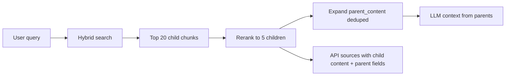

# JurisGuard — Clause Chunking & Retrieved-Source UI Specification

**Status:** Approved product requirement — incorporated into MASTER STRATEGY Phases 2 and 4  
**Priority:** P0 for pilot trust (legal users must verify what the model saw)  
**Replaces:** Character-limit chunking (`worker.py` `chunk_text(max_chars=1200)`)

---

## 1. Expert verdict — why this is non-negotiable

**Agree.** Legal RAG fails user trust when:

1. **Chunk boundaries split mid-clause** — the model cites "Section 4.2" but the retrieved text is bytes 900–2100 of a paragraph. Users cannot audit the answer.
2. **The UI hides retrieval** — today `rag.py` returns `sources` with `label`, `source`, and `distance` only; **not** the chunk text the user needs to verify ([`_format_context`](../../backend/src/services/rag.py) line 25).
3. **Char-limit chunking is the wrong abstraction** — contracts and statutes are **tree-structured** (Regulation → Article → Paragraph; MSA → Section → Clause → Sub-clause). Retrieval should respect that tree.

**Target:** ~10× improvement in chunk semantic coherence by moving from paragraph/char splits to **whole-clause units** plus **parent-child expansion** (port and extend V1 `parent_id` pattern from `backend/src/query.py`).

---

## 2. User-facing requirement — show exact retrieved chunks

### 2.1 UI behavior (Phase 4)

Every RAG response (chat, analyze, compare) MUST include a **Retrieved Sources** panel:

| Element | Requirement |
|---------|-------------|
| **Exact chunk text** | Full `content` of each retrieved **child** chunk — not truncated to 300 chars |
| **Rank/scores** | Vector `distance`, cross-encoder `rerank_score`, display order (#1–#5) |
| **Provenance** | `chunk_id`, `document_id` (if matter doc), `filename` or law label (e.g. `GDPR Art. 6(1)(f)`) |
| **Clause path** | Human-readable path: `§ 4.2 Indemnification`, `GDPR Art. 28(3)` |
| **Parent expand** | "Show full section" toggles **parent** text (surrounding clause group) |
| **Used in answer** | Optional highlight when citation verifier links answer span to chunk |
| **Empty/refusal** | If confidence gate fires: panel shows "No chunks met relevance threshold" |

### 2.2 Wireframe components

- `RetrievedSourcesPanel` — list of `SourceChunkCard`
- `SourceChunkCard` — collapsed: label + scores; expanded: full child `content` + parent toggle
- `CompareView` — **two** source panels: document chunks vs law chunks

### 2.3 API contract (Phase 2 — backend must ship before UI)

Extend all RAG responses (`POST /chat`, `POST /matters/.../analyze`, `POST /matters/.../compare`):

```json
{
  "answer": "...",
  "model": "phi3.5",
  "sources": [
    {
      "rank": 1,
      "chunk_id": 1842,
      "document_id": "550e8400-e29b-41d4-a716-446655440000",
      "label": "NDA — Clause 4.2 Indemnity",
      "clause_path": "4.2",
      "content": "The Vendor shall indemnify and hold harmless the Client against any claims arising from...",
      "parent_chunk_id": 1840,
      "parent_label": "Section 4 — Indemnification",
      "parent_content": "Section 4. Indemnification\n\n4.1 General. ...\n\n4.2 The Vendor shall indemnify...",
      "distance": 0.38,
      "rerank_score": 0.92,
      "metadata": {
        "kind": "contract",
        "chunk_tier": "child",
        "source": "contract"
      }
    }
  ],
  "retrieval_meta": {
    "top_k": 20,
    "rerank_k": 5,
    "pipeline": "hybrid"
  }
}
```

**Breaking change from today:** `_format_context()` must append full fields to `sources`, not strip `content`.

Optional: `GET /api/v1/chunks/{chunk_id}` for deep-link from audit log (Phase 4b).

---

## 3. Chunking strategy — structure-first (10× coherence target)

### 3.1 Principles

| Rule | Rationale |
|------|-----------|
| **Never split inside a numbered clause** | Clause is the atomic unit of legal meaning |
| **Child = retrieval unit** | Smallest embeddable whole clause (typically 80–800 tokens) |
| **Parent = context unit** | Section heading + all child clauses in that section (cap ~2400 chars) |
| **Law = Article/§ boundary** | GDPR `Art. N`, BGB `§ N`; split sub-paragraphs only when Article exceeds cap |
| **Char limit is fallback only** | Use `max_chars` only when no structure detected (plain text letter) |

### 3.2 Law corpus chunking (`ingest_law.py` + `advanced_chunking.py`)

**Current:** Mixed structure-aware intent; not fully wired.  
**Target:**

```
Regulation (GDPR)
  └── Article 6                    → parent node (DLG Phase 5)
        └── Paragraph (1)          → child chunk (embed)
        └── Paragraph (1)(f)       → child if split needed
```

Parser rules:

- GDPR: `Art\.?\s*(\d+)`, `(1)(f)` sub-paragraph patterns
- BGB: `§\s*(\d+)`, `Abs\.?\s*(\d+)`
- Metadata: `{ kind: "law", source: "gdpr", article: "6", paragraph: "1", title: "...", chunk_tier: "child", parent_article: "6" }`
- Parent row: optional second insert with `chunk_tier: "parent"`, same `article`, full article text, **not** duplicated in vector index OR embedded with lower priority — prefer **metadata-only parent** on child to save storage

**Recommended storage (Phase 2):**

- Embed **child** only
- Store `parent_content` in child metadata JSONB (denormalized) for UI + LLM expansion
- Re-ingest entire law corpus after implementation

### 3.3 Contract chunking (`worker.py` — replace `chunk_text`)

**Current (bad):**

```python
def chunk_text(text: str, max_chars: int = 1200)  # splits mid-clause
```

**Target:** new `services/clause_chunker.py`

Detection order:

1. Numbered outline: `^\d+(\.\d+)*\.?\s+`, `(a)`, `(i)`, `ARTICLE IV`
2. German patterns: `§\s*\d+`, `Abs\.?\s*\d+`
3. ALL-CAPS section headers followed by body
4. Double-newline paragraphs (fallback, same as today)

Output per clause:

```python
@dataclass
class ClauseChunk:
    content: str           # full clause text
    clause_path: str       # e.g. "4.2" or "ARTICLE_4"
    section_title: str | None
    parent_content: str    # section aggregate
    chunk_index: int
    chunk_tier: Literal["child", "parent"]
    parent_chunk_index: int | None
```

**Parent aggregation:** Group consecutive children under same `section_title` / top-level number into `parent_content`.

### 3.4 Retrieval pipeline with parent-child



- **Search index:** child embeddings only
- **LLM prompt:** use expanded parent text (dedupe by `parent_chunk_id`) up to `rag_max_context_chars`
- **API sources:** return ranked **children** with full text; include `parent_content` for UI expand

### 3.5 Success metrics (Phase 3 eval)

| Metric | Baseline (char chunks) | Target (clause chunks) |
|--------|------------------------|-------------------------|
| Gold clause substring in top-5 | TBD measure Phase 3 | **+30% relative** minimum |
| User-rated "chunk matches question" (design partner) | — | **≥4/5** on 20 prompts |
| Mid-clause split rate in ingest audit | High | **<2%** of contract chunks |

---

## 4. Implementation plan (mapped to phases)

### Phase 2 (backend — week 6–7 priority)

| Task | File |
|------|------|
| Implement `clause_chunker.py` | `services/clause_chunker.py` |
| Replace `chunk_text()` in worker | `worker.py` |
| Wire `advanced_chunking` for law | `ingest_law.py` |
| Extend `_format_context` + source schema | `rag.py`, `schemas.py` |
| Parent expansion in prompt builder | `rag.py` |
| Migration: metadata schema documented | `alembic/006_clause_metadata.py` optional |
| Tests: clause boundaries, parent expand | `tests/test_clause_chunker.py`, `test_parent_child.py` |
| Re-ingest law + re-process sample contracts | ops scripts |

### Phase 4 (frontend)

| Task | Component |
|------|-----------|
| Full chunk text in source cards | `SourceChunkCard.tsx` |
| Parent toggle | `ParentClauseExpand.tsx` |
| Compare dual panels | `CompareSourcesPanel.tsx` |
| Playwright: assert sources[0].content visible | `chat.spec.ts` |

### Phase 5 (DLG synergy)

- Law **parent** nodes in DLG align with clause `article` metadata
- Graph explorer navigates same tree users see in source panel

---

## 5. Anti-patterns

| Do not | Do instead |
|--------|------------|
| Show only labels in UI | Full child `content` always |
| Embed parent + child both in index (duplicate) | Embed child; parent in metadata |
| Keep 1200-char default for contracts | Clause parser with char fallback |
| Fetch chunk content in second HTTP round-trip | Include in RAG response payload |
| Split on token count first | Split on legal structure first |

---

## 6. Checklist items (master doc Part 13)

| ID | Item | Phase | Status |
|----|------|-------|--------|
| CHK-UI-01 | API returns full chunk `content` in `sources[]` | 2 | Planned |
| CHK-UI-02 | UI displays exact retrieved chunks | 4 | Planned |
| CHK-UI-03 | Parent clause expand in source panel | 4 | Planned |
| CHK-CH-01 | Replace `chunk_text(1200)` with clause chunker | 2 | Planned |
| CHK-CH-02 | Law ingest whole-Article/§ boundaries | 2 | Planned |
| CHK-CH-03 | Parent-child prompt expansion | 2 | Planned |
| CHK-CH-04 | Re-ingest corpus after chunking change | 2 | Planned |
| CHK-CH-05 | Eval: clause coherence vs baseline | 3 | Planned |

---

*This spec is merged into `JurisGuard_MASTER_STRATEGY.md` via `build_master_strategy_doc.py`.*
