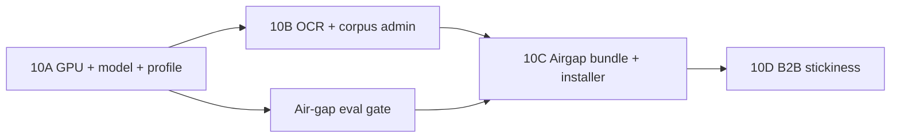

# JurisGuard V2 — Phase 10 Production Plan

**Version:** 1.0  
**Date:** June 2026  
**Hardware target:** Victus laptop · **RTX 4050 6 GB VRAM** · WSL2 Ubuntu · ~7 GB RAM  
**Prerequisite:** Phases 1–9 complete (see `docs/PROJECT_MASTER_HANDOFF.md`)  
**Goal:** Close the gap between “strong engineering portfolio” and “deployable B2B on-prem product”

---

## 1. Executive summary

External review scored JurisGuard at **~52/100** for B2B readiness. That score is **directionally fair** for daily lawyer use and IT self-install, but **partially misstates what the codebase already does**.

| Area | Review claim | Codebase reality |
|------|--------------|------------------|
| Latency root cause | CPU embed + rerank | ✅ **Confirmed** — reranker hardcoded `device="cpu"`; Docker image uses **CPU-only PyTorch**, so `torch.cuda.is_available()` is **false inside api/worker containers** even with a GPU on the host |
| HyDE always on | Global config | ⚠️ **Half true** — `HYDE_ENABLED=false` by default, but **`ADAPTIVE_HYDE_ENABLED=true`** triggers extra **T1 Ollama calls** on vague queries; CRAG retry can force HyDE on second pass |
| Multi-query = extra LLM | Two LLM calls | ❌ **Wrong** — `query_decompose.py` is **rule-based**, no LLM |
| Air-gap bundle | Probably hollow | ✅ **Confirmed** — `scripts/airgap_bundle.sh` writes only `MANIFEST.json` (~15 lines), no tarballs or weights |
| Corpus = GDPR+BGB only | Too narrow | ⚠️ **Partially wrong** — `ingest_law.py` already lists **BDSG + EU AI Act** if files exist; still **no admin upload UI** and still EU-centric |
| Bulk upload | Missing | ❌ **Wrong** — `POST .../documents/bulk` (zip) exists |
| OCR | Missing | ✅ **Confirmed** — `document_parser.py` uses pypdf text extract only; scanned PDFs → empty ingest |
| Refresh tokens | Missing | ✅ **Confirmed** — single JWT, `auth_token_expire_minutes=60`, no refresh/revocation table |
| White-label | Missing | ✅ **Confirmed** — “JurisGuard” hardcoded in `LoginPage.jsx`, `Sidebar.jsx` |

**Target after Phase 10:** **high 70s / low 80s** on the same rubric — pilot-deployable on your hardware with honest latency (target **4–8 s p95 chat** on RTX 4050, not sub-second).

---

## 2. Root-cause analysis — latency

### 2.1 Current hot path (measured June 2026)

| Stage | Dev (OpenRouter T2) | Air-gap risk (phi3.5 CPU Ollama) |
|-------|---------------------|----------------------------------|
| Embed query (bge-m3) | ~200–800 ms CPU in Docker | Same or worse |
| Hybrid retrieve + rerank | ~100–500 ms | Same |
| HyDE (if adaptive triggers) | +0 ms (cloud path) | **+2–8 s** T1 Ollama call |
| T2 generation | ~8–14 s (network + model) | **+15–45 s** on CPU Ollama |
| **p95 total** | **~11–17 s** | **~30–60 s** plausible |

### 2.2 Why GPU fixes are non-trivial today

```text
backend/Dockerfile          → torch CPU wheel only (Layer C)
services/reranker.py:38     → device="cpu" (hardcoded)
services/embeddings.py:48   → cuda IF available (never true in current container)
docker-compose.yml          → no deploy.resources.devices / nvidia runtime
Ollama                      → host.docker.internal OR optional profile; GPU = host config
```

**VRAM budget (your 6 GB) — realistic:**

| Component | VRAM | Notes |
|-----------|------|-------|
| Mistral-7B-Instruct Q4_K_M | ~4.1 GB | Recommended air-gap T2 |
| bge-m3 (CUDA) | ~0.55 GB | Query + batch ingest |
| ms-marco reranker | ~0.15 GB | 20 pairs |
| **Total** | **~4.8 GB** | Fits; leave ~1 GB for CUDA overhead |
| Qwen2.5-3B Q4 (fallback) | ~2.0 GB | If concurrent requests or OOM |

**Do not promise 2–5 s p95 until benchmarked on your machine.** Realistic post-GPU target: **4–8 s p95** for typical 512-token answers; streaming UX makes this acceptable.

### 2.3 Recommended deployment topology (WSL2 + RTX 4050)

**Option A — Hybrid (fastest to ship, ~1 week)**

| Process | Where | GPU |
|---------|-------|-----|
| Ollama (T1 + T2) | **Native WSL** (`ollama serve`) | ✅ `OLLAMA_NUM_GPU=99` |
| API + worker | Docker (CPU torch) | ❌ |
| Embeddings/rerank | **Host venv** for ingest scripts OR second “gpu-worker” profile later | ✅ via host CUDA venv |

Pros: no CUDA Docker rebuild. Cons: split ops complexity.

**Option B — Full GPU Docker (cleaner, ~2 weeks)**

| Process | Where | GPU |
|---------|-------|-----|
| Ollama | `docker-compose.gpu.yml` with NVIDIA runtime | ✅ |
| API + worker | CUDA PyTorch image + `device=cuda` embed/rerank | ✅ |

Requires: `nvidia-container-toolkit` on WSL2, new `Dockerfile.gpu`, `torch` CUDA wheel.

**Recommendation:** Start **Option A** for Week 1 benchmarks; migrate to **Option B** before customer USB bundle.

---

## 3. Phase 10 workstreams (prioritized)



| ID | Workstream | Impact | Effort | Blocks |
|----|------------|--------|--------|--------|
| **10A** | GPU acceleration + air-gap model + latency profile | **Critical** | 1–2 weeks | Real pilot UX |
| **10B** | OCR + jurisdiction corpus admin | **Critical** | 1–2 weeks | Legal doc reality |
| **10C** | Real air-gap bundle + setup wizard | **High** | 1 week | B2B IT deploy |
| **10D** | White-label + refresh tokens + async chat UX | **High** | 1–2 weeks | Enterprise + lawyers |
| **10E** | Clause library | **Medium** | 2–3 weeks | Stickiness / 80+ score |
| **10F** | Calendar, .msg, Word redline | **Low v1** | Backlog | Deal-closers later |

---

## 4. Workstream 10A — Latency, GPU, air-gap correctness

### 10A.1 — Air-gap latency profile (config only, Day 1)

**Problem:** `docker-compose.prod.yml` sets Ollama but not retrieval latency flags.

**Changes:**

| Setting | Dev default | Air-gap default | File |
|---------|-------------|-----------------|------|
| `ADAPTIVE_HYDE_ENABLED` | `true` | **`false`** | `.env.airgap.example`, `docker-compose.prod.yml` |
| `HYDE_ENABLED` | `false` | `false` | already OK |
| `CRAG_RETRY_ENABLED` | `true` | **`false`** (or retry without HyDE) | `config.py` + prod compose |
| `GRAPH_EXTRACTION_ENABLED` | `true` | **`false`** for ingest speed optional | worker env |
| `OLLAMA_MODEL` | phi3.5 | **`mistral:7b-instruct-q4_K_M`** | `.env.airgap.example` |

**Code change — CRAG without forced HyDE:**

```python
# services/rag.py — today retry uses hyde=True always
retry = await _pass(rewrite, hyde=False)  # when air-gap profile
```

Add `settings.airgap_latency_profile: bool` or derive from `LLM_PROVIDER=ollama`.

**Acceptance:**

- [ ] Vague query (“What about data protection?”) makes **zero** T1 calls when `ADAPTIVE_HYDE_ENABLED=false`
- [ ] `make eval-latency` p95 improves ≥30% vs current air-gap baseline

---

### 10A.2 — Reranker GPU + config device

**Files:** `services/reranker.py`, `config.py`

```python
# config.py
embedding_device: str = Field(default="auto", validation_alias="EMBEDDING_DEVICE")  # auto|cuda|cpu
reranker_device: str = Field(default="auto", validation_alias="RERANKER_DEVICE")

# reranker.py — mirror embeddings.py auto-detect
device = _resolve_device(settings.reranker_device)
_model = CrossEncoder(path, device=device)
```

**Acceptance:**

- [ ] Unit test mocks device selection
- [ ] Log line on startup: `Loaded reranker from: ... device=cuda`

---

### 10A.3 — GPU Ollama on WSL (native, Day 2–3)

**Not in repo today — operator runbook + script:**

```bash
# scripts/setup_ollama_gpu.sh
curl -fsSL https://ollama.com/install.sh | sh
export OLLAMA_NUM_GPU=99
ollama pull mistral:7b-instruct-q4_K_M
ollama pull qwen2.5:0.5b   # T1 aux
```

**`.env` for Docker API/worker:**

```env
OLLAMA_BASE_URL=http://host.docker.internal:11434
OLLAMA_MODEL=mistral:7b-instruct-q4_K_M
OLLAMA_AUX_MODEL=qwen2.5:0.5b
LLM_PROVIDER=ollama
```

**Acceptance:**

- [ ] `nvidia-smi` shows Ollama VRAM ~4 GB during chat
- [ ] `curl localhost:11434/api/generate` with mistral completes <10 s for 256 tokens

---

### 10A.4 — CUDA embeddings (choose path)

#### Path A — Host-side embed service (quick)

Run a tiny sidecar OR bind-mount host venv with CUDA torch for worker only during ingest.

#### Path B — `docker-compose.gpu.yml` (recommended end state)

```yaml
# docker-compose.gpu.yml
services:
  api:
    build:
      dockerfile: Dockerfile.gpu
    deploy:
      resources:
        reservations:
          devices:
            - driver: nvidia
              count: 1
              capabilities: [gpu]
    environment:
      EMBEDDING_DEVICE: cuda
      RERANKER_DEVICE: cuda
```

**New `Dockerfile.gpu`:** Replace CPU torch layer with:

```dockerfile
RUN pip install torch==2.6.0 --index-url https://download.pytorch.org/whl/cu124
```

**Acceptance:**

- [ ] `embed_texts(["test"])` logs `device=cuda` inside container
- [ ] Single-query embed <100 ms p95

---

### 10A.5 — Air-gap quality gate (mandatory)

**Today:** `make airgap-eval` runs logical + native RAGAS but **logical API eval is best-effort** (`|| true` in script).

**Changes:**

| Task | Detail |
|------|--------|
| Fix `scripts/airgap_eval.sh` | Fail CI if logical pass rate < 95% |
| Record baseline | `eval/baseline.json` → add `api_airgap_mistral7b` section |
| Model in report | Write `model`, `embedding_device`, `p95_ms` into `logical_latest.json` |
| Gate | Update `Makefile` `airgap-eval` to require API up + Ollama mistral |

**Acceptance:**

- [ ] `make airgap-eval` exits non-zero if pass rate < 95%
- [ ] Documented result in `eval/reports/logical_latest.json` with `LLM_PROVIDER=ollama`

**Realistic expectation:** Mistral-7B may score **95–98%** vs phi-4-mini **99.1%** — that trade is acceptable for offline.

---

### 10A.6 — Async chat jobs (UX without hiding latency)

**Pattern already exists:** `workflows/gap-analysis` → Redis job → poll (see `services/workflow_jobs.py`, `worker.py`).

**Extend to chat:**

| Endpoint | Behavior |
|----------|----------|
| `POST /api/v1/chat/async` | Enqueue `chat_task`, return `{ job_id }` |
| `GET /api/v1/chat/jobs/{id}` | `{ status, answer, sources }` |
| UI | Show “Research in progress…” with step hints (retrieve → rerank → generate) |

Lawyers tolerate 8 s if the UI is non-blocking. This does **not** replace 10A GPU work but **decouples perceived latency from HTTP timeout**.

**Files:** `routers/chat.py`, `worker.py`, `ChatView.jsx`  
**Effort:** 3–4 days  
**Acceptance:** E2E test polls job to completion

---

## 5. Workstream 10B — Documents & corpus

### 10B.1 — OCR fallback pipeline (Critical)

**Trigger:** After `pypdf` extract, if `len(text.strip()) < 50 * num_pages` → OCR path.

**Implementation:**

```text
services/document_parser.py
  parse_pdf() → try pypdf
  if low_text: parse_pdf_ocr() → pdf2image + pytesseract (default)
  optional: EASYOCR_ENABLED=true for stamped/low-contrast docs
```

**Docker/system deps:**

```dockerfile
# Dockerfile — add to worker (ingest-heavy)
RUN apt-get install -y tesseract-ocr tesseract-ocr-deu poppler-utils
```

**Python:** `pytesseract`, `pdf2image` in `requirements-base.txt`

**Worker behavior:**

- Set document metadata `ocr_used: true` on chunks
- If still empty → status `failed` with `error: "no_text_extracted"` (not silent empty)
- UI: show “OCR processed” badge in Matters doc table

**Acceptance:**

- [ ] Integration test: image-only PDF fixture → chunks > 0
- [ ] Golden scanned NDA processes to `status=processed`

**Effort:** 4–6 days

---

### 10B.2 — Jurisdiction corpus admin (High)

**Today:** `POST /api/v1/corpus/ingest-law` returns CLI instructions only (`routers/corpus.py`).

**Target API:**

| Endpoint | Role | Body |
|----------|------|------|
| `POST /api/v1/admin/corpus/upload` | org_admin | multipart PDF/TXT + `{ jurisdiction, title, source_slug }` |
| `POST /api/v1/admin/corpus/{id}/ingest` | org_admin | triggers Celery `ingest_law_document_task` |
| `GET /api/v1/admin/corpus/sources` | org_admin | list indexed sources + chunk counts |

**Reuse:** `ingest_law.py` → extract `ingest_text_corpus(db, raw, meta)` shared function.

**Schema addition (migration `014_corpus_sources`):**

```text
corpus_sources
  id, org_id?, slug, title, jurisdiction, file_path, document_id (uuid), status, created_at
```

- `org_id NULL` = global (install-time seed)
- `org_id set` = tenant-specific pack (multi-tenant B2B)

**UI:** Admin tab “Law corpus” — upload + ingest progress (reuse doc status polling pattern).

**Acceptance:**

- [ ] Upload UK GDPR excerpt PDF → appears in `corpus/stats` under new source
- [ ] Research chat retrieves new source when `use_law_corpus=true`
- [ ] Gap analysis `search_law` finds hits from new corpus

**Effort:** 1–1.5 weeks

---

### 10B.3 — Expand seed packs (content, not code)

**Already wired in code** (`LAW_FILES` in `ingest_law.py`):

- `bdsg_de.txt`
- `eu_ai_act_en.txt`

**Action:** Ensure `scripts/download_assets.py` fetches them; document in air-gap bundle. Add optional packs (PECA, UK DPA) as customer-specific corpus uploads via 10B.2 — **no hardcoded jurisdiction list in code**.

---

## 6. Workstream 10C — Packaging & install

### 10C.1 — Real air-gap bundle (replace hollow script)

**Target artifact:** `dist/jurisguard-airgap-YYYYMMDD.tar.zst` (~8–15 GB)

**Contents:**

```text
jurisguard-airgap/
├── images/
│   ├── juris-api.tar
│   ├── juris-worker.tar
│   ├── pgvector.tar
│   └── redis.tar
├── models/
│   ├── ollama/
│   │   ├── mistral-7b-instruct-q4_K_M.gguf  (or ollama export blob)
│   │   └── qwen2.5-0.5b.gguf
│   ├── huggingface/
│   │   ├── bge-m3/
│   │   └── reranker/
│   └── MANIFEST.sha256
├── corpus/
│   └── law_corpus/*.txt
├── compose/
│   ├── docker-compose.yml
│   ├── docker-compose.prod.yml
│   └── docker-compose.gpu.yml   (optional)
├── config/
│   └── .env.airgap.template
├── setup.sh
├── verify.sh
└── README-INSTALL.md
```

**Rewrite `scripts/airgap_bundle.sh`:**

1. `docker compose build` → `docker save` each image
2. Copy `data/models/*` if present; else fail with “run download_assets first”
3. `ollama show mistral --modelfile` or copy from `~/.ollama/models`
4. `sha256sum` manifest
5. `tar` + `zstd` compress

**Acceptance:**

- [ ] Fresh Ubuntu VM with **no internet** runs `setup.sh` → health OK
- [ ] `verify.sh` runs `make eval-offline` (no LLM)

**Effort:** 5–7 days

---

### 10C.2 — Setup wizard (`setup.sh`)

**Interactive steps:**

1. Check Docker ≥24, Compose v2, optional `nvidia-smi`
2. Load image tarballs (`docker load`)
3. Copy models to `data/models`, Ollama import
4. Prompt: `AUTH_SECRET_KEY`, admin email/password, org name
5. `docker compose -f ... up -d`
6. `alembic upgrade head`
7. `python scripts/seed_admin.py` (new)
8. Optional: `run_ingest_law.py` if DB empty
9. Print URL `http://localhost:8002/app`

**Windows variant:** `setup.ps1` for firms without WSL (lower priority).

**Acceptance:**

- [ ] Non-developer can complete in <30 min with README only
- [ ] Playwright smoke against installed instance

**Effort:** 3–5 days

---

## 7. Workstream 10D — Enterprise UX & security

### 10D.1 — White-label branding

**Backend (`config.py` + `routers/public_config.py`):**

```env
BRAND_NAME="Schmidt & Partners Legal AI"
BRAND_TAGLINE="On-Premise Research"
BRAND_LOGO_URL="/static/branding/logo.png"   # or data URL
BRAND_PRIMARY_COLOR="#1e3a5f"
```

```python
GET /api/v1/config/branding  # no auth — safe fields only
```

**Frontend:**

- `App.jsx` fetch branding on boot
- Replace hardcoded strings in `LoginPage.jsx`, `Sidebar.jsx`
- CSS variable `--accent` from `BRAND_PRIMARY_COLOR`

**Acceptance:**

- [ ] Change `.env` only → UI shows new name without rebuild (or rebuild once for logo file)

**Effort:** 2–3 days

---

### 10D.2 — Refresh tokens + session revocation

**Schema (`015_refresh_tokens`):**

```text
refresh_tokens
  id, user_id, token_hash, expires_at, revoked_at, created_at, user_agent?
```

**Flow:**

| Step | Detail |
|------|--------|
| Login | Return `access_token` (15 min) + `refresh_token` (7 d, httpOnly cookie optional) |
| Refresh | `POST /auth/refresh` rotates refresh token |
| Revoke | Admin `POST /admin/users/{id}/revoke-sessions` |
| SSO | Unchanged — IdP session separate |

**Files:** `auth_utils.py`, `routers/auth.py`, `deps.py`, frontend token refresh interceptor in `lib/api.js`

**Acceptance:**

- [ ] SOC 2 control narrative: short-lived access + revocable refresh
- [ ] Integration test: revoked refresh → 401

**Effort:** 4–5 days

---

## 8. Workstream 10E — Clause library (stickiness)

**Not in codebase. Highest ROI feature for retention after 10A–10C.**

### 8.1 Data model

```text
clause_library_items
  id, org_id, clause_type (indemnity|limitation|governing_law|...),
  title, body_text, jurisdiction, version, is_standard, created_by, created_at

clause_library_versions  (optional v2 — start with updated_at on item)
```

### 8.2 API

| Endpoint | Purpose |
|----------|---------|
| `GET/POST/PATCH /api/v1/clause-library` | CRUD |
| `POST /api/v1/matters/{id}/compare-clause` | Upload excerpt vs library item → reuse compare RAG |

### 8.3 UI

- Admin / Matters sidebar: “Clause bank”
- “Compare to our standard indemnity” button in analyze panel

**Acceptance:**

- [ ] Firm saves standard NDA indemnity clause
- [ ] Upload deviates → compare flags deviation in report

**Effort:** 2–3 weeks

---

## 9. Backlog (10F — deal-closers, not Phase 10 gate)

| Feature | Notes | Effort |
|---------|-------|--------|
| Matter calendar / deadlines | New module; not started | 3–4 weeks |
| `.msg` / `.eml` parsing | `extract-msg` library in worker | 1 week |
| Word tracked-changes redline | OOXML diff — out of 9F scope | 6–8 weeks |
| Full folder bulk import | Extend bulk beyond zip | 3 days |
| Prometheus metrics | Phase 8 partial | 1 week |

---

## 10. Implementation schedule (your hardware, solo dev)

### Sprint 1 (Week 1) — “Make air-gap fast enough”

| Day | Task | Deliverable |
|-----|------|-------------|
| 1 | 10A.1 air-gap profile + CRAG fix | `.env.airgap.example`, prod compose |
| 2 | 10A.3 Ollama GPU native + mistral pull | Runbook + benchmark script |
| 3 | 10A.2 reranker device auto | Code + unit test |
| 4 | 10A.5 air-gap eval gate (strict) | `eval/baseline.json` updated |
| 5 | 10A.6 async chat MVP | API + UI poll |

**Exit criteria:** `make airgap-eval` ≥95%; chat p95 <15 s (stretch <8 s with GPU Ollama)

---

### Sprint 2 (Week 2) — “Handle real legal PDFs”

| Day | Task |
|-----|------|
| 1–3 | 10B.1 OCR pipeline + Docker deps + tests |
| 4–5 | 10B.2 corpus admin API (backend only) |

**Exit criteria:** Scanned PDF ingest test passes

---

### Sprint 3 (Week 3) — “IT can install it”

| Day | Task |
|-----|------|
| 1–3 | 10C.1 rewrite `airgap_bundle.sh` |
| 4–5 | 10C.2 `setup.sh` + `seed_admin.py` |

**Exit criteria:** Offline install test on clean VM

---

### Sprint 4 (Week 4) — “Looks like their product”

| Day | Task |
|-----|------|
| 1–2 | 10D.1 white-label |
| 3–5 | 10D.2 refresh tokens |

**Optional Week 5+:** 10A.4 CUDA Docker + 10E clause library

---

## 11. Test & regression gates (add to CI)

| Gate | Command | Required for release |
|------|---------|---------------------|
| Unit | `make test-unit` | 87+ pass |
| Integration | `make test-integration` | 35+ pass |
| E2E | `make e2e` | 43+ pass |
| Logical offline | `make eval-offline` | 20/20 |
| **Logical air-gap** | `make airgap-eval` | **≥95%** (strict) |
| Latency | `make eval-latency` | chat p95 < 90000 ms (tighten to 15000 after 10A) |
| OCR | `pytest tests/test_ocr_ingest.py` | new |
| Bundle smoke | `scripts/verify_airgap_bundle.sh` | new |

---

## 12. Score projection

| Rubric item | Today | After 10A | After 10A–10C | After 10E |
|-------------|-------|-----------|---------------|-----------|
| Latency | ~15 | ~35 | ~40 | ~40 |
| OCR | 0 | 0 | ~15 | ~15 |
| Air-gap quality proof | ~5 | ~15 | ~15 | ~15 |
| Air-gap bundle | ~5 | ~5 | ~15 | ~15 |
| Installer | ~5 | ~5 | ~15 | ~15 |
| Corpus breadth | ~8 | ~8 | ~15 | ~15 |
| White-label | ~4 | ~4 | ~4 | ~4 |
| Clause library | 0 | 0 | 0 | ~15 |
| Architecture/tests | ~25 | ~25 | ~25 | ~25 |
| **Total (approx.)** | **~52** | **~62** | **~74** | **~82** |

---

## 13. What we should NOT claim until Phase 10 done

- “Fully offline USB install” (bundle is a manifest today)
- “Works on scanned contracts” (no OCR)
- “95%+ quality offline” (not gated)
- “Sub-5 second answers” (not benchmarked on Mistral+GPU)
- “Any jurisdiction out of the box” (EU seed + admin upload only after 10B.2)

---

## 14. File change index (quick reference)

| Workstream | Primary files |
|------------|---------------|
| 10A GPU | `Dockerfile.gpu`, `docker-compose.gpu.yml`, `services/reranker.py`, `services/embeddings.py`, `config.py`, `.env.airgap.example` |
| 10A profile | `docker-compose.prod.yml`, `services/rag.py`, `services/query_enhance.py` |
| 10A async chat | `routers/chat.py`, `worker.py`, `frontend ChatView.jsx` |
| 10B OCR | `services/document_parser.py`, `worker.py`, `backend/Dockerfile` |
| 10B corpus | `routers/admin.py` or `routers/corpus.py`, `ingest_law.py`, migration `014_*`, `AdminView.jsx` |
| 10C bundle | `scripts/airgap_bundle.sh`, `scripts/setup.sh`, `scripts/seed_admin.py` |
| 10D brand | `config.py`, `routers/public_config.py`, `LoginPage.jsx`, `Sidebar.jsx` |
| 10D auth | `auth_utils.py`, `routers/auth.py`, migration `015_*`, `lib/api.js` |
| 10E clauses | migration `016_*`, `routers/clause_library.py`, new UI component |

---

## 15. Immediate next actions (this week)

1. Create `.env.airgap.example` with Mistral + `ADAPTIVE_HYDE_ENABLED=false`
2. Fix `reranker.py` device auto-detect
3. Run `ollama pull mistral:7b-instruct-q4_K_M` on WSL with GPU; benchmark 20 golden questions
4. Make `airgap_eval.sh` fail on <95%
5. Spike OCR on one scanned PDF in `document_parser.py`

---

*This plan supersedes latency and packaging sections in `PROJECT_MASTER_HANDOFF.md` §12 until Phase 10 is complete.*
