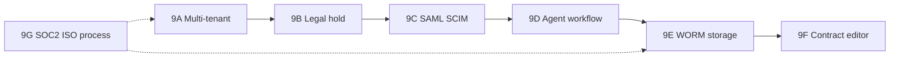
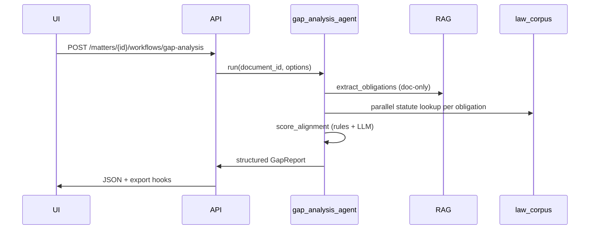

# JurisGuard V2 — Phase 9 Enterprise Implementation Plan

**Version:** 1.0  
**Date:** June 2026  
**Audience:** Engineering, DPO, procurement  
**Prerequisites:** Phases 1–8 complete (UI trust, RBAC surfaces, audit, streaming, RAGAS dashboard, doc exports, backend hardening, deploy)  
**North star:** On-prem EU legal teams — grounded RAG + immutable audit — not Harvey cloud parity

---

## Executive summary

Phase 9 delivers the **deferred enterprise capabilities** that were intentionally skipped before pilot quality and audit were solid. Each top-level phase maps to **one** procurement-grade capability, broken into **sub-modules** with schema, API, UI, tests, and acceptance criteria.

| Phase | Capability | Duration (est.) | Blocks |
|-------|------------|-----------------|--------|
| **9A** | Multi-tenant org isolation | 2–3 weeks | SaaS, true enterprise RBAC |
| **9B** | Legal hold | 1–2 weeks | eDiscovery, DPO retention |
| **9C** | SAML / OIDC / SCIM SSO | 3–5 weeks | Enterprise IdP procurement |
| **9D** | Bounded agent workflow (gap analysis) | 3–4 weeks | “Harvey-lite” demo without open ReAct |
| **9E** | WORM & immutable audit storage | 2–3 weeks | Regulator-grade evidence chain |
| **9F** | In-browser contract workspace | 4–8 weeks | Redline / clause editing UX |
| **9G** | SOC 2 / ISO 27001 readiness (process) | 3–12 months | Enterprise sales cycle |

**Recommended execution order:** 9A → 9B → 9C → 9D → 9E → 9F, with **9G running in parallel** from day one of 9A (policies, not code).



---

## Current baseline (what Phase 9 extends)

| Area | Shipped (Phases 1–8) | Gap |
|------|----------------------|-----|
| Auth | JWT, roles, `GET /auth/me`, OIDC callback stub | No SAML, no SCIM |
| Org | `organizations`, `users.org_id`, org-scoped admin/audit | Matters/chunks not fully org-isolated; no RLS |
| Audit | Append-only events, CSV export, chat query hash | Not WORM-backed; no legal-hold-aware delete |
| RAG | Hybrid + rerank + adaptive HyDE + CRAG-lite | No multi-step agent orchestration |
| UI | Research, Matters, Admin, Help, export PDF/MD | No rich contract editor |
| Compliance | In-app RBAC matrix, air-gap profile | No SOC2/ISO control library |

---

# Phase 9A — Multi-tenant org isolation

**Goal:** Two orgs on one deployment cannot read each other’s matters, documents, chunks, threads, or audit — enforced at DB + retrieval layer, not only in routers.

**Duration:** 2–3 weeks  
**Risk if skipped:** SaaS pivot blocked; cross-org data leak in shared Postgres

### 9A.1 — Schema & migration

| Task | Detail |
|------|--------|
| Backfill `matters.org_id` | Set from creating user’s `org_id`; nullable → NOT NULL after backfill |
| Add `org_id` to `matter_documents` | Denormalized for fast filters |
| Add `org_id` to `document_chunks.metadata` | JSONB key `org_id` on every chunk at ingest |
| Add `org_id` to `chat_threads`, `chat_messages` (optional FK) | Matter-linked threads inherit matter org |
| Index | `(org_id)`, `(org_id, document_id)` on hot tables |

**Deliverable:** Alembic `007_org_isolation.py`  
**Files:** `backend/alembic/versions/`, `backend/src/db.py`

### 9A.2 — Application enforcement

| Submodule | Work |
|-----------|------|
| **9A.2a Matter CRUD** | Create matter always sets `org_id=user.org_id`; list/filter by org |
| **9A.2b Document ingest** | Worker stamps `org_id` on chunks + graph nodes |
| **9A.2c Vector retrieval** | `vector_store.py`: mandatory `org_id` filter when user has org |
| **9A.2d Cross-org invite block** | Already partial — extend tests for matter members across orgs |
| **9A.2e Dev master** | Dev user stays in default org only |

**Files:** `routers/matters.py`, `services/vector_store.py`, `worker/ingest*.py`, `deps.py`

### 9A.3 — Postgres RLS (optional hardening)

| Task | Detail |
|------|--------|
| Enable RLS on `matters`, `matter_documents`, `audit_events` | Policy: `org_id = current_setting('app.org_id')::uuid` |
| Session var per request | Middleware sets `SET LOCAL app.org_id` after JWT decode |
| Bypass role | Migration superuser only — document for air-gap admins |

**Deliverable:** Alembic `008_rls_policies.py` (feature-flag `RLS_ENABLED`)

### 9A.4 — UI & admin

| Task | Detail |
|------|--------|
| Org switcher | **Defer** until true multi-org users exist; single org per user for pilot |
| Admin org settings | `GET/PATCH /api/v1/admin/org` — name, slug, retention defaults |
| Help panel | Document org boundary in Help view |

**Files:** `frontend/src/components/AdminView.jsx`, `routers/admin.py`

### 9A.5 — Tests & acceptance

| Test | Criterion |
|------|-----------|
| `test_org_isolation_matters.py` | Org A cannot GET/DELETE Org B matter → 404 |
| `test_org_isolation_retrieval.py` | Org A query never returns Org B chunks |
| E2E | Register two orgs, upload doc each, cross-access fails |
| **Acceptance** | 100% org-scoped list endpoints; zero cross-org leaks in integration suite |

---

# Phase 9B — Legal hold

**Goal:** DPO can place a **hold** on a matter or document; deletes, exports, and erasure requests are blocked until hold released; all hold actions audited.

**Duration:** 1–2 weeks  
**Depends on:** 9A (org-scoped holds)

### 9B.1 — Data model

```text
legal_holds
  id, org_id, matter_id?, document_id?, reason, placed_by, placed_at, released_at?, status
```

| Field | Rule |
|-------|------|
| `status` | `active` \| `released` |
| Scope | Matter-level hold applies to all docs in matter |
| Cascade | Document-level hold overrides export/delete for that doc only |

**Deliverable:** Alembic `009_legal_holds.py`, `LegalHold` model

### 9B.2 — API sub-modules

| Endpoint | Role | Behavior |
|----------|------|----------|
| `POST /matters/{id}/legal-hold` | org_admin+ | Place hold; audit `legal_hold_place` |
| `DELETE /matters/{id}/legal-hold/{hold_id}` | org_admin+ | Release; audit `legal_hold_release` |
| `GET /matters/{id}/legal-holds` | matter_lead+ | List active/released |
| `POST /documents/{id}/legal-hold` | org_admin+ | Document-scoped hold |

**Files:** `routers/legal_hold.py` (new), `services/legal_hold.py`

### 9B.3 — Enforcement hooks

| Hook | Behavior |
|------|----------|
| `DELETE /matters/{id}` | 409 if active hold |
| `DELETE /documents/{id}` | 409 if matter or doc hold |
| Chunk erasure worker | Skip chunks under hold |
| Export | Allow export (hold preserves evidence) — configurable `LEGAL_HOLD_ALLOW_EXPORT` |
| GDPR erasure API (future) | Queue erasure; execute only when no hold |

**Files:** `routers/matters.py`, `worker/erasure.py` (stub)

### 9B.4 — UI

| Component | Detail |
|-----------|--------|
| Matters detail | “Legal hold” banner + Place/Release buttons (admin) |
| Audit filter | `action=legal_hold_*` |
| Help | When to use hold vs confidentiality tier |

**Files:** `MattersView.jsx`, `AuditView.jsx`

### 9B.5 — Tests & acceptance

| Criterion |
|-----------|
| Active hold → matter delete returns 409 with clear message |
| Hold/release appears in audit CSV |
| Member cannot place hold (403) |

---

# Phase 9C — SAML / OIDC / SCIM enterprise SSO

**Goal:** Enterprise customers authenticate via IdP (Azure AD, Okta, Keycloak); users/groups provisioned via SCIM 2.0; JurisGuard JWT issued after SSO.

**Duration:** 3–5 weeks  
**Depends on:** 9A (org mapping from IdP groups)

### 9C.1 — OIDC hardening (extend existing)

| Submodule | Work |
|-----------|------|
| **9C.1a Frontend callback route** | `/auth/callback` page exchanges code via backend |
| **9C.1b Org mapping** | IdP claim `groups` → JurisGuard role (config map in `organizations.settings`) |
| **9C.1c Session refresh** | Refresh token or re-auth policy; document token TTL |
| **9C.1d Logout** | RP-initiated logout URL |

**Files:** `routers/oidc.py`, `frontend/src/pages/AuthCallback.jsx`

### 9C.2 — SAML 2.0 Service Provider

| Submodule | Work |
|-----------|------|
| **9C.2a SP metadata** | `GET /api/v1/auth/saml/metadata` XML |
| **9C.2a ACS endpoint** | `POST /api/v1/auth/saml/acs` — validate assertion, issue JWT |
| **9C.2b Library** | `python3-saml` or `authlib` — pinned, air-gap installable |
| **9C.2c Config** | `SAML_ENABLED`, entity ID, cert paths, IdP metadata URL |
| **9C.2d Single logout** | Optional SLO |

**Files:** `routers/saml.py`, `services/saml_sp.py`, `config.py`

### 9C.3 — SCIM 2.0 provisioning

| Submodule | Work |
|-----------|------|
| **9C.3a SCIM bearer auth** | Org-scoped SCIM token (hashed in DB) |
| **9C.3b Users** | `GET/POST/PATCH/DELETE /scim/v2/Users` |
| **9C.3c Groups → roles** | Map SCIM group displayName to `member`/`org_admin` |
| **9C.3d Deprovision** | Soft-disable user; invalidate sessions |
| **9C.3e Idempotency** | `externalId` on users table |

**Schema addition:**

```text
users.external_id, users.idp_source, users.disabled_at
scim_tokens (org_id, token_hash, created_by)
```

**Files:** `routers/scim.py`, `services/scim_users.py`

### 9C.4 — UI & docs

| Deliverable |
|-------------|
| Admin → SSO settings panel (OIDC/SAML URLs, test login) |
| `docs/SSO_SETUP.md` — Azure AD + Keycloak walkthrough |
| Login page: “Sign in with SSO” when enabled |

### 9C.5 — Tests & acceptance

| Criterion |
|-----------|
| OIDC e2e with Keycloak docker profile |
| SAML response fixture test (signed assertion mock) |
| SCIM create user → can login; SCIM delete → 401 on old token |
| No password login when `PASSWORD_LOGIN_DISABLED=true` (optional org setting) |

---

# Phase 9D — Bounded agent workflow (regulatory gap analysis)

**Goal:** One **fixed** multi-step workflow — not open Harvey ReAct — that DPO can demo: extract obligations → search law → score gaps → structured report.

**Duration:** 3–4 weeks  
**Depends on:** Phase 5 eval ≥95% logical pass; 9A org scope

### 9D.1 — Agent architecture (constrained)



**Design rules (LLM08 mitigation):**

- Fixed tool list: `extract_clauses`, `search_law`, `compare_clause`, `finalize_report`
- Max 12 tool calls per run
- No arbitrary code execution
- All steps audited with `action=agent_step`

### 9D.2 — Sub-modules

| ID | Module | Detail |
|----|--------|--------|
| **9D.2a** | `services/agents/gap_analysis.py` | Orchestrator state machine |
| **9D.2b** | `services/agents/tools.py` | Tool wrappers calling existing RAG |
| **9D.2c** | `schemas/gap_report.py` | Pydantic: obligations[], gaps[], severity |
| **9D.2d** | `routers/workflows.py` | `POST .../workflows/gap-analysis`, `GET .../status` |
| **9D.2e** | Celery task | Long docs run async; poll status |
| **9D.2f** | Export | Reuse Phase 6 compare report + new gap table |

### 9D.3 — UI (“Words-to-Workflow” lite)

| Component | Detail |
|-----------|--------|
| Matters → **Run gap analysis** button | Disabled until doc processed |
| Progress stepper | Extract → Search law → Score → Report |
| Results panel | Traffic-light table: clause / law ref / gap / recommendation |
| Not in scope | Free-form agent chat, user-defined workflows |

**Files:** `WorkflowView.jsx` or extend `MattersView.jsx`

### 9D.4 — Eval & acceptance

| Criterion |
|-----------|
| Golden fixture: NDA + GDPR → report mentions confidentiality + lawful basis |
| Agent never exceeds call budget (unit test) |
| Faithfulness ≥ baseline on 10-case agent eval subset |
| Full run audited (≥4 audit events per workflow) |

---

# Phase 9E — WORM storage & immutable audit

**Goal:** Audit log and optional document blobs meet **write-once-read-many** expectations for DPO/regulator review; deletion is logical + provable, not silent overwrite.

**Duration:** 2–3 weeks  
**Depends on:** 9B legal hold (erasure vs retention policy)

### 9E.1 — Audit WORM layer

| Submodule | Work |
|-----------|------|
| **9E.1a Hash chain** | Each audit row: `prev_hash`, `row_hash` (SHA-256 chain) |
| **9E.1b Periodic seal** | Daily job writes `audit_seals` record (Merkle root or last hash) |
| **9E.1c Verify API** | `GET /audit/verify?from=&to=` → chain valid true/false |
| **9E.1d Export bundle** | Signed JSON manifest + CSV for external counsel |

**Schema:** `audit_events.prev_hash`, `audit_seals` table

### 9E.2 — Blob WORM (air-gap options)

| Option | When |
|--------|------|
| **A: Filesystem** | Append-only dir + `chattr +i` on sealed bundles (Linux pilot) |
| **B: MinIO** | Object Lock compliance mode; `docker compose` profile |
| **C: S3** | Object Lock — cloud hybrid customers only |

**Submodule 9E.2a:** Abstract `StorageBackend` — `put`, `get`, `delete` (no-op under hold/WORM)

**Files:** `services/storage/worm.py`, `config.py` (`WORM_BACKEND=filesystem|minio|s3`)

### 9E.3 — Vector erasure (GDPR Art. 17)

| Submodule | Work |
|-----------|------|
| **9E.3a Hard delete** | `DELETE FROM document_chunks WHERE document_id=?` + reindex |
| **9E.3b Erasure certificate** | Audit event + optional PDF for DPO pack |
| **9E.3c Ghost vector mitigation** | Full segment vacuum or index rebuild doc in `docs/GDPR_ERASURE.md` |

### 9E.4 — UI & acceptance

| Criterion |
|-----------|
| Audit verify endpoint passes on fresh install |
| Tamper one row in DB → verify fails |
| Legal hold blocks erasure job |
| README: WORM mode for air-gap vs MinIO profile |

---

# Phase 9F — In-browser contract workspace

**Goal:** Review and lightly edit contract text in-app — clause annotations, comments, export to Word/PDF — **not** full Ironclad CLM.

**Duration:** 4–8 weeks  
**Depends on:** 9A org scope, 9D gap report (optional sidebar)

### 9F.1 — Document model upgrade

| Submodule | Work |
|-----------|------|
| **9F.1a Parsed structure** | Store `clauses[]` with `{ id, title, start, end, text }` from ingest |
| **9F.1b Versioning** | `document_versions` — v1 upload, v2 after edit |
| **9F.1c Diff** | Text diff between versions (for audit, not Word redline yet) |

### 9F.2 — Editor sub-modules

| ID | Module | Stack |
|----|--------|-------|
| **9F.2a** | `ContractEditor.jsx` | Tiptap or ProseMirror |
| **9F.2b** | Clause sidebar | Jump list from structured analysis |
| **9F.2c** | AI assist (bounded) | “Explain clause”, “Compare to GDPR Art. 28” — calls analyze API |
| **9F.2d** | Annotations | Highlight + comment thread per clause (DB: `clause_annotations`) |
| **9F.2e** | Autosave | Debounced PATCH; conflict detection |

**Out of scope for 9F v1:** Real-time multi-user co-editing, Word add-in, tracked changes OOXML

### 9F.3 — Export sub-modules

| Format | Detail |
|--------|--------|
| Markdown | Clause table + body |
| PDF | fpdf2 — existing pipeline |
| DOCX | `python-docx` — paragraph styles, optional comment balloons v2 |

**Files:** `services/export_docx.py`, `routers/export.py`

### 9F.4 — RBAC & audit

| Rule |
|------|
| Edit requires matter role `editor+` |
| Every save → audit `document_edit` with version id + diff hash |
| Legal hold → read-only editor |

### 9F.5 — Acceptance

| Criterion |
|-----------|
| Upload NDA → open editor → edit clause → export DOCX |
| Viewer role cannot save (403) |
| E2E Playwright: open editor, type, save, reload persists |

---

# Phase 9G — SOC 2 / ISO 27001 readiness (process track)

**Goal:** Produce evidence pack for enterprise procurement — **not** certification itself in code.

**Duration:** 3–12 months (parallel to 9A–9F)  
**Owner:** Security + legal + engineering leads

### 9G.1 — Control mapping

| Framework | JurisGuard evidence source |
|-----------|----------------------------|
| SOC 2 CC6 | RBAC tests, SSO, audit log |
| SOC 2 CC7 | CI/CD, eval gates, incident runbook |
| ISO 27001 A.9 | Access control matrix in Help + admin |
| ISO 27001 A.12 | Change management — git + PR reviews |
| GDPR Art. 17/30 | Erasure workflow (9E), ROPA template |

**Deliverable:** `docs/compliance/CONTROL_MATRIX.md`

### 9G.2 — Policy documents (sub-modules)

| Document | Owner |
|----------|-------|
| Information Security Policy | CISO / lead eng |
| Data Retention & Legal Hold Policy | DPO |
| Incident Response Plan | DevOps |
| Vendor / sub-processor list | Legal (OpenRouter optional disclosure) |
| BCP/DR for on-prem | Customer-run; provide `docs/DISASTER_RECOVERY.md` template |

### 9G.3 — Technical evidence automation

| Submodule | Work |
|-----------|------|
| **9G.3a** | `scripts/compliance_evidence.sh` — zip audit sample, test results, config redacted |
| **9G.3b** | Dependency SBOM | `pip-audit`, `npm audit` in CI |
| **9G.3c** | Pen test readiness | API auth boundary doc for external tester |

### 9G.4 — Acceptance (readiness, not cert)

| Criterion |
|-----------|
| Control matrix 80%+ mapped to existing features post-9E |
| One internal audit dry-run completed |
| Customer-facing `SECURITY.md` + `docs/compliance/` folder in repo |

---

## Cross-phase dependencies

```text
9A (org isolation)
 ├── 9B (legal hold) — holds are org-scoped
 ├── 9C (SCIM) — users provisioned into org
 ├── 9D (agent) — workflow runs in org context
 ├── 9E (WORM) — seals per org optional
 └── 9F (editor) — versions org-scoped

9B (legal hold)
 └── 9E (erasure vs WORM)

9C (SSO)
 └── optional gate for 9F editor in enterprise tenants

9G (SOC2/ISO)
 └── consumes evidence from all phases; start early
```

---

## CI / eval gates per phase

| Phase | New CI requirement |
|-------|-------------------|
| 9A | `test_org_isolation*.py` required |
| 9B | Hold blocks delete integration test |
| 9C | SAML/SCIM fixture tests (optional profile `sso`) |
| 9D | Agent budget + golden gap report |
| 9E | Audit chain verify unit test |
| 9F | Playwright editor smoke |
| 9G | SBOM + evidence script (no fail on audit) |

---

## Effort summary (engineering FTE)

| Phase | Backend | Frontend | DevOps | Total person-weeks |
|-------|---------|----------|--------|-------------------|
| 9A | 1.5 | 0.25 | 0.25 | ~2 |
| 9B | 1 | 0.5 | — | ~1.5 |
| 9C | 2.5 | 0.5 | 1 | ~4 |
| 9D | 2 | 1 | — | ~3 |
| 9E | 1.5 | 0.25 | 1 | ~2.5 |
| 9F | 1.5 | 3 | — | ~4.5 |
| 9G | 0.5 | — | 0.5 | process-heavy |

**Total engineering:** ~17–20 person-weeks (excluding SOC2 audit fees and external pen test).

---

## What we still defer (Phase 10+)

| Item | Why |
|------|-----|
| Open-ended Harvey agents | Needs 9D eval proof + LLM08 controls |
| Lexis / Westlaw corpus licensing | Commercial, not build |
| Word add-in | Separate product surface |
| Full CLM lifecycle (signatures, CLM stages) | Ironclad territory |
| Multi-region active-active | Pilot is single-tenant on-prem |

---

## Quick start — first sprint (9A only)

**Week 1**

1. Migration `007_org_isolation` + backfill script  
2. `vector_store.py` org filter on all retrieval paths  
3. `test_org_isolation_matters.py` + retrieval test  

**Week 2**

4. Worker ingest stamps `org_id` on chunks  
5. Admin org settings endpoint  
6. E2E two-org negative test  
7. Update Help panel with org boundary note  

**Definition of done:** CI green; no cross-org access in integration suite; README section “Multi-tenant deployment”.

---

## Related documents

- [PHASE_IMPLEMENTATION_PLAN.md](./PHASE_IMPLEMENTATION_PLAN.md) — Phases 0–8 (superseded by master strategy for detail)
- [ARCHITECTURE.md](../ARCHITECTURE.md) — current system design
- [README.md](../README.md) — deploy and eval commands
- Enterprise roadmap (Phases 1–8) — Cursor plan `jurisguard_enterprise_roadmap`
