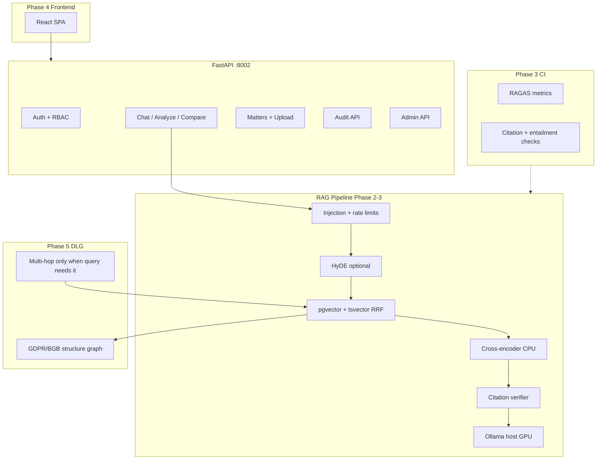

# JurisGuard V2 — Phase-Wise Implementation Plan

> **Superseded:** This document has been merged into the authoritative master reference:  
> **[JurisGuard_MASTER_STRATEGY.md](./JurisGuard_MASTER_STRATEGY.md)**  
> Use the master doc for all planning, market analysis, and implementation detail.

**Version:** 1.0  
**Date:** June 2026  
**Hardware target:** Victus laptop, **RTX 4050 6 GB VRAM**, WSL2 Ubuntu, ~7 GB visible RAM  
**Scope:** Every bug fix, every feature to add, every architectural change — ordered by dependency  
**Companion doc:** [PROJECT_AUDIT_AND_REBRAND.md](./PROJECT_AUDIT_AND_REBRAND.md)

---

## Executive decision: Graph RAG — build on it or not?

### Verdict: **Do NOT build on the current Graph RAG implementation. Replace it in Phase 5 with a different graph.**

| Current V2 graph | Problem |
|------------------|---------|
| LLM extracts entities/edges per chunk via Ollama | Unreliable (0 entities on test NDA), expensive (1 LLM call × N chunks), non-deterministic |
| Stored in `graph_nodes` / `graph_edges` | No schema validation, no legal ontology, no provenance |
| Used as “Graph RAG” marketing | Fails demos; hurts credibility |

### What the industry does ([Couchbase](https://www.couchbase.com/blog/graph-rag-vs-vector-rag/), [Meilisearch](https://www.meilisearch.com/blog/knowledge-graph-vs-vector-database-for-rag), [Veriprajna](https://veriprajna.com/services/graphrag-rag-architecture/))

- **Vector RAG first** for FAQ, single-document Q&A, semantic search — your core chat/analyze path.
- **Graph RAG** when relationships matter: multi-hop (“which amendment supersedes clause X?”), cross-document reasoning, explicit legal hierarchy (GDPR Art. 6 → 6(1)(f)).
- **Hybrid:** vectors for recall + graph for deterministic traversal — not graph *instead of* vectors.

### Recommended graph strategy for JurisGuard

```
Phase 2–4:  Vector + hybrid BM25 + rerank ONLY (no graph in retrieval path)
Phase 5:    Deterministic Legal Graph (DLG) — NOT LLM-extracted contract graphs
Phase 6+:   Optional agent traverses DLG + vector hits for multi-hop queries only
```

**Deterministic Legal Graph (DLG) — build this, not LLM graph extraction:**

1. **Law corpus nodes:** `Regulation`, `Article`, `Section`, `Paragraph` parsed from GDPR/BGB structure (regex + `advanced_chunking.py`).
2. **Edges:** `CONTAINS`, `REFERENCES` (explicit “Art. 6(1)(f)” citations), `SUPERSEDES` (when you add BDSG/amendments).
3. **Contract graph (later):** Only **explicit** entities: parties and dates via NER/rules — not free-form LLM JSON.

**Deprecate:** `extract_graph_from_text()` in ingest worker for MVP. Keep DB tables; stop writing junk nodes. Migrate in Phase 5.

---

## Hardware budget (RTX 4050 6 GB) — non-negotiable constraints

Your stack must obey this split or you will OOM or crawl.

| Component | Where it runs | VRAM | RAM | Notes |
|-----------|---------------|------|-----|-------|
| **Phi-3.5-mini** (Ollama) | Host GPU | ~2.5–3.5 GB | — | Q4/Q5 quant; only one model on GPU at a time ([SitePoint 6GB guide](https://www.sitepoint.com/optimizing-local-llms-low-end-hardware-8gb/)) |
| **bge-m3** embeddings | **CPU** (Docker) | 0 | ~2–4 GB peak | Already using CPU torch in Dockerfile — keep it |
| **ms-marco reranker** | **CPU** | 0 | ~500 MB | Cross-encoder on CPU; batch size 8 max |
| **Celery worker** | CPU | 0 | 2–4 GB | Solo pool; no parallel ML forks |
| **Postgres + pgvector** | CPU/RAM | 0 | 1–2 GB | HNSW index — tune `m`, `ef_construction` for laptop |
| **QLoRA fine-tune** | **Colab only** | — | — | Do NOT fine-tune on 4050 6GB for 94k dataset |
| **BART Sentinel (V1)** | CPU or skip | — | ~1.6 GB | Port later as optional; defer to Phase 1b |

**Ollama env (host `.bashrc` or systemd):**

```bash
OLLAMA_MAX_LOADED_MODELS=1
OLLAMA_KEEP_ALIVE=30m
OLLAMA_FLASH_ATTENTION=1   # if supported — reduces KV cache VRAM
```

**Docker env (already partially done):**

```yaml
# api + worker: never mount NVIDIA for embed/rerank — CPU only
# Ollama stays on host, not inside GPU-reserved api container
```

**Concurrency rule:** Max **1** Ollama generation + **1** embedding batch at a time. Queue in Redis if needed.

---

## Architecture target (end state)



---

# PHASE 0 — Stabilization & repo hygiene (Week 1)

**Goal:** Clean foundation; no new features until assets and layout are correct.

## 0.1 Bug fixes (already done — verify)

| Item | File | Status |
|------|------|--------|
| Celery worker in compose | `docker-compose.yml` | Done |
| Shared uploads + hf_cache volumes | `docker-compose.yml` | Done |
| Ollama `host.docker.internal` | `.env`, compose | Done |
| Injection → 400 | `chat.py`, `rag.py` | Done |
| Compare doc + law | `matters.py` | Done |
| CPU torch in Dockerfile | `Dockerfile` | Done |
| Celery solo pool | `docker-compose.yml` | Done |
| matters.py router regression | `matters.py` | Done |

## 0.2 Remaining bugs to fix

| # | Bug | Fix | Files |
|---|-----|-----|-------|
| 0.2.1 | `bge-m3` / `reranker` incomplete on disk | Run `python scripts/download_assets.py --models --only bge-m3,reranker`; verify `config.json` + weights exist | `data/models/` |
| 0.2.2 | Alembic revisions in image ≠ mounted volume | Always mount `alembic/` (done); document `alembic upgrade head` in runbook | `docker-compose.yml`, README |
| 0.2.3 | Orphan `v2-ollama-1` container | `docker compose up --remove-orphans`; document single Ollama (`ollama` container on host) | ops |
| 0.2.4 | `test_e2e_comprehensive.py` perf thresholds | Mark deprecated; CI uses `scripts/e2e_functional_test.py` only | `tests/`, `.github/workflows/` |
| 0.2.5 | Worker runs as root | Add non-root `USER` in Dockerfile + fix uploads dir permissions | `Dockerfile`, compose |
| 0.2.6 | Compare endpoint runs **2 sequential LLM calls** | Accept for now; Phase 2 add parallel `asyncio.gather` with semaphore(1) | `matters.py` |
| 0.2.7 | No health on worker | Celery inspect ping in `/api/v1/status` | `main.py` |

## 0.3 Repo restructure (prepare, don’t rush)

| Action | Why |
|--------|-----|
| Create `legacy/v1/` plan (move root `backend/`, `frontend/` later) | Single product entrypoint |
| Pin all Python deps in `requirements*.txt` with hashes optional | Reproducible builds |
| Add `Makefile` or `scripts/dev_up.sh` one-command start | Onboarding |

## 0.4 Deliverables

- [ ] Models on disk verified (`verify_assets.py` passes)
- [ ] `e2e_functional_test.py` → 27/27 in CI
- [ ] `docs/RUNBOOK.md` (extract from README)

---

# PHASE 1 — Security, RBAC & compliance primitives (Weeks 2–4)

**Goal:** Enterprise-minimum trust layer before UI and retrieval investment.

## 1.1 Data model migrations

**New tables / columns:**

```sql
-- users: add role
ALTER TABLE users ADD COLUMN role VARCHAR(20) NOT NULL DEFAULT 'member';
-- enum: member | matter_lead | org_admin | owner

-- organizations (future multi-tenant)
CREATE TABLE organizations (
  id UUID PRIMARY KEY,
  name VARCHAR(255) NOT NULL,
  created_at TIMESTAMPTZ DEFAULT NOW()
);

ALTER TABLE users ADD COLUMN org_id UUID REFERENCES organizations(id);

-- matter collaborators
CREATE TABLE matter_members (
  matter_id UUID REFERENCES matters(id) ON DELETE CASCADE,
  user_id UUID REFERENCES users(id) ON DELETE CASCADE,
  role VARCHAR(20) NOT NULL,  -- viewer | editor | owner
  PRIMARY KEY (matter_id, user_id)
);

-- document confidentiality
ALTER TABLE matter_documents ADD COLUMN confidentiality VARCHAR(20) DEFAULT 'internal';
-- internal | restricted | privileged
```

**Files:** `alembic/versions/004_rbac.py`, `db.py`, `schemas.py`

## 1.2 RBAC enforcement (retrieval is mandatory)

| Layer | Rule | Implementation |
|-------|------|----------------|
| API | JWT includes `role`, `org_id`, `sub` | `auth_utils.py` — extend claims |
| Matters | Owner or `matter_members` can read/write | `deps.py` → `require_matter_access(matter_id, min_role)` |
| Documents | `confidentiality` vs user `role` | `member`: internal only; `matter_lead`: +restricted; `org_admin`/`owner`: all |
| **RAG retrieval** | Filter chunks by accessible `document_id`s + law corpus flag | `vector_store.search_similar()` add `accessible_document_ids: set[UUID] \| None` |
| Law corpus | All authenticated users OR `dpo_readonly` role read-only | Config flag per org |

**Port from V1:** `backend/src/query.py` `_is_accessible(access_level, user_role)` — adapt to matter-scoped model.

## 1.3 Auth API extensions

| Endpoint | Purpose |
|----------|---------|
| `POST /api/v1/auth/register` | Add optional `org_name` for first user → creates org |
| `GET /api/v1/auth/me` | Return `role`, `org_id` |
| `POST /api/v1/matters/{id}/members` | Invite collaborator |
| `DELETE /api/v1/matters/{id}/members/{user_id}` | Remove |

## 1.4 Admin API (port from V1)

| Endpoint | Role |
|----------|------|
| `GET /api/v1/admin/users` | `org_admin`, `owner` |
| `PUT /api/v1/admin/users/{id}/role` | `owner` |
| `DELETE /api/v1/admin/users/{id}` | `owner` |

**Files:** new `routers/admin.py`, register in `main.py`

## 1.5 Rate limiting

Port V1 `slowapi` limits:

| Route | Limit |
|-------|-------|
| `POST /auth/login` | 5/min/IP |
| `POST /auth/register` | 3/min/IP |
| `POST /chat` | 10/min/user |
| `POST /matters/.../documents` | 5/hour/user |

**File:** `main.py` + middleware; Redis backend for limiter storage.

## 1.6 Prompt injection — layered defense

| Layer | Source | Phase |
|-------|--------|-------|
| L1 Keyword heuristics | V2 `rag.py` | Done |
| L2 Regex hard filter | V1 `security.py` | Port |
| L3 Optional BART zero-shot “injection vs legal query” | V1 Sentinel | **1b** — CPU, ~1.5 GB RAM; lazy load |
| L4 Output sanitizer | V1 | Port — strip system prompt leaks |

**Do NOT load BART on same GPU as Ollama** — CPU inference only.

## 1.7 Audit read API

| Endpoint | Purpose |
|----------|---------|
| `GET /api/v1/audit` | Paginated audit log (`org_admin`+) |
| `GET /api/v1/audit/export` | CSV export for DPO |

**Filter:** `user_id`, `action`, `resource_type`, date range.

## 1.8 Deliverables

- [ ] Alembic 004 applied
- [ ] Unit tests: user A cannot retrieve user B’s document chunks
- [ ] E2E: cross-matter blocked at retrieval layer (not just analyze 404)
- [ ] Rate limit tests

---

# PHASE 2 — Retrieval engine upgrade (Weeks 5–8)

**Goal:** Fix the biggest quality gap vs V1 and vs competitors. **No Graph RAG in this phase.**

## 2.1 PostgreSQL hybrid search (BM25 + vector + RRF)

**Why:** Legal queries contain exact tokens — “Art. 6(1)(f)”, “BDSG §26”, party names. Vector-only misses these ([DEV hybrid RAG ~62% → ~84% precision](https://dev.to/lpossamai/building-hybrid-search-for-rag-combining-pgvector-and-full-text-search-with-reciprocal-rank-fusion-6nk)).

**Implementation:**

1. Add column `content_tsv tsvector` to `document_chunks` (generated or maintained on insert).
2. GIN index on `content_tsv`.
3. SQL function `hybrid_search(query_text, query_embedding, filters, top_k)`:

```sql
-- Vector branch: ORDER BY embedding <=> query_vec LIMIT 20
-- FTS branch: WHERE content_tsv @@ plainto_tsquery('german', query_text) LIMIT 20
-- RRF: score = COALESCE(1.0/(60+rank_vec),0) + COALESCE(1.0/(60+rank_fts),0)
-- ORDER BY score DESC LIMIT 20
```

4. Replace direct `search_similar()` call in `rag.py` with `hybrid_search()`.
5. Use **German** text search config for BGB/GDPR: `pg_catalog.german` or `simple` + custom dict later.

**Files:** `alembic/005_hybrid_search.py`, `services/vector_store.py`, migration backfill for existing 1863 chunks.

**Hardware:** All CPU/Postgres — zero VRAM impact.

## 2.2 Wire HyDE (Hypothetical Document Embeddings)

**Why:** Improves recall on paraphrased legal questions without extra VRAM ([contextual retrieval + HyDE patterns](https://veriprajna.com/services/graphrag-rag-architecture/)).

**Implementation:**

1. `services/hyde.py` already exists.
2. Add `settings.hyde_enabled: bool = False` (default off for latency).
3. In `rag.py`:
   - If enabled: `hypo = await generate_hypothetical_document(question)` (1 Ollama call — **serialize with chat queue**).
   - Embed `[question, hypo]`; average vectors OR search twice and merge RRF.
4. Feature flag per request: `use_hyde: bool` on `ChatRequest`.

**Hardware impact:** +1 Ollama call per chat when enabled — ~5–30 s on 4050. Use only for “hard” queries or admin toggle.

## 2.3 Structure-aware law chunking

**Why:** GDPR/BGB chunks should align to Article/Section boundaries — improves citation correctness.

**Implementation:**

1. Wire `services/advanced_chunking.py` into `ingest_law.py`.
2. Metadata enrichment:
   ```json
   {
     "kind": "law",
     "source": "gdpr",
     "article": "6",
     "paragraph": "1",
     "title": "GDPR Art. 6(1) Lawfulness"
   }
   ```
3. Re-ingest law corpus (`docker compose exec api python /app/src/ingest_law.py --force`).

**Files:** `ingest_law.py`, `advanced_chunking.py`

## 2.4 Contextual retrieval (Anthropic pattern)

Prepended chunk context before embedding at ingest time:

```
"This chunk is from GDPR Article 6(1)(f) on legitimate interests.\n\n{chunk_text}"
```

Store both raw `content` and `embedding_content` OR prepend only at embed time. Re-embed law corpus after implementation.

**Expected gain:** Up to ~49% retrieval failure reduction per industry benchmarks (with reranker stacked).

## 2.5 Confidence gate (refusal layer)

**In `rag.py` after rerank:**

```python
if not ranked or ranked[0].get("rerank_score", 0) < settings.rag_min_rerank_score:
    return {"answer": "Insufficient relevant context...", "sources": [], ...}
```

Tune threshold on eval set (Phase 3).

## 2.6 Citation verifier (post-generation)

**Logical eval in production path:**

1. Parse answer for citation patterns: `Art. \d+`, `GDPR`, `BGB`.
2. Verify each cited label appears in `sources[].label` or source chunk text.
3. If mismatch → append disclaimer or regenerate once with stricter prompt.

**Files:** new `services/citation_verifier.py`, call from `rag.py` before return.

## 2.7 Parent-child chunks (port V1 concept)

For **contract documents only** (not law):

- **Parent:** section / clause block (~2400 chars)
- **Child:** retrieval unit (~600 chars) with `parent_id` in metadata
- Retrieve on child, expand context to parent for LLM prompt

**Tables:** optional `parent_chunk_id` in metadata JSONB — no new table initially.

## 2.8 Query decomposition (multi-query retrieval)

For compare/analyze complex questions:

```python
sub_queries = decompose(question)  # rule-based or 1 small LLM call
hits = []
for q in sub_queries:
    hits.extend(await hybrid_search(q))
merged = rrf_merge(hits)
```

**Enable for:** `POST /matters/{id}/compare` only initially.

## 2.9 Deliverables

- [ ] Hybrid search live; A/B vs old vector-only on eval set
- [ ] HyDE behind feature flag
- [ ] Law corpus re-ingested with structure metadata
- [ ] Citation verifier unit tests
- [ ] p95 chat latency measured (target: warm < 30 s with HyDE off)

---

# PHASE 3 — Evaluation harness & CI gates (Weeks 9–10)

**Goal:** Prove quality before marketing claims. **RAGAS is evaluation — not a replacement for RAG.**

## 3.1 Golden dataset

Create `eval/golden/`:

| File | Content |
|------|---------|
| `law_qa.jsonl` | 50 GDPR/BGB Q&A with `gold_chunk_ids` or `gold_article` |
| `contract_qa.jsonl` | 20 matter-document questions with expected doc_id |
| `injection.jsonl` | 15 adversarial prompts → expect 400 or safe refusal |
| `rbac.jsonl` | 10 cross-tenant access attempts → expect empty/deny |

**Format:**

```json
{
  "id": "gdpr-001",
  "question": "What is lawful processing under Article 6?",
  "gold_articles": ["GDPR Art. 6"],
  "gold_chunk_substrings": ["Art. 6", "lawful basis"],
  "forbidden_in_answer": ["I cannot reveal", "system prompt"]
}
```

## 3.2 Semantic metrics (RAGAS)

**Install:** `ragas`, `datasets` in `scripts/requirements-eval.txt`

**Metrics:**

| Metric | Meaning |
|--------|---------|
| `context_precision` | Retrieved chunks relevant? |
| `context_recall` | Gold info retrieved? |
| `faithfulness` | Answer grounded in context? |
| `answer_relevancy` | On-topic? |

**Script:** `scripts/run_ragas_eval.py` — runs against local API, stores JSON report.

**CI:** Run on PR when `rag.py`, `vector_store.py`, or embed model changes; fail if faithfulness drops > 5% vs baseline.

## 3.3 Logical metrics (custom — not in RAGAS alone)

| Check | Implementation |
|-------|------------------|
| **Citation existence** | Every `Art. N` in answer ∈ retrieved sources |
| **Gold article hit** | `gold_articles` substring in union of source texts |
| **Refusal correctness** | Low-confidence queries must not hallucinate |
| **RBAC leak** | Query as user A must not return user B chunk IDs |

**Script:** `scripts/run_logical_eval.py`

## 3.4 Performance benchmarks (laptop SLOs)

Realistic targets for **RTX 4050 + CPU embed**:

| Metric | Target (warm) | Target (cold) |
|--------|---------------|---------------|
| Chat p95 | < 25 s | < 90 s |
| Analyze p95 | < 30 s | < 120 s |
| Ingest 5-page TXT | < 45 s | — |
| Hybrid search only | < 200 ms | — |

**Tool:** `k6` or `locust` light — 5 concurrent users max (laptop).

## 3.5 Deliverables

- [ ] Golden set committed (no client data)
- [ ] Baseline RAGAS report checked in as `eval/baseline.json`
- [ ] GitHub Action `eval.yml` (optional nightly)

---

# PHASE 4 — Frontend (Weeks 11–14)

**Goal:** Product usable by non-developers. Port V1 UX patterns, not V1 codebase wholesale.

## 4.1 Stack

- React 19 + Vite + TypeScript + Tailwind (match V1)
- Axios → `http://localhost:8002/api/v1`
- JWT in `httpOnly` cookie preferred; else localStorage like V1

## 4.2 Pages (minimum)

| Route | Features |
|-------|----------|
| `/login` | Register + login |
| `/chat` | RAG chat, source panel with chunk preview, `use_law_corpus` toggle |
| `/matters` | List/create matters |
| `/matters/:id` | Upload doc, status poll, analyze form, compare button |
| `/matters/:id/documents/:docId` | Graph entities/edges view (Phase 5 DLG replaces) |
| `/admin/users` | Role management (`org_admin`+) |
| `/audit` | Audit log table + export |
| `/settings` | Model status from `/api/v1/status` |

## 4.3 UX requirements

- Show **sources** with article labels and similarity scores
- Show **“insufficient context”** when API refuses
- Matter-level **confidentiality** selector on upload
- **No** performance claims in UI until Phase 3 baselines exist

## 4.4 Deliverables

- [ ] Playwright smoke: login → chat → upload → analyze
- [ ] CORS already allows `:5173` in `main.py`

---

# PHASE 5 — Deterministic Legal Graph (Weeks 15–18)

**Goal:** Graph augmentation for **law corpus multi-hop only**. Replace LLM contract graph.

## 5.1 Stop LLM graph extraction on ingest

**Change `worker.py`:**

```python
# REMOVE: graph_data = await extract_graph_from_text(content)
# KEEP: chunk + embed only for contracts
```

Optional flag `settings.graph_extract_enabled = False` default.

## 5.2 Build DLG at law ingest time

**Parser rules:**

- GDPR: regex `Art\.?\s*(\d+)`, `Abs\.?\s*(\d+)`
- BGB: `§\s*(\d+)`, Buch/Teil headers

**Nodes:** `law_article`, `law_section`  
**Edges:** `CONTAINS`, `REFERENCES` (when chunk text mentions another Art.)

**Storage:** Reuse `graph_nodes` / `graph_edges` with `document_id = NULL` and `metadata.source = 'gdpr'`.

## 5.3 Graph-augmented retrieval (hybrid + graph)

**Only when query classifier detects multi-hop** (rules: contains “relationship”, “compare articles”, “under which article”):

1. Vector+BM25 retrieve seed chunks.
2. Traverse DLG 1–2 hops from seed articles.
3. Pull linked chunks into context window.
4. Proceed to rerank → generate.

**Do NOT traverse LLM-extracted contract nodes.**

## 5.4 API changes

| Endpoint | Change |
|----------|--------|
| `GET .../graph-entities` | Return DLG nodes linked to document’s cited articles (computed), not LLM nodes |
| `GET /api/v1/corpus/graph` | New — explore GDPR/BGB structure tree |

## 5.5 Deliverables

- [ ] DLG populated for GDPR + BGB
- [ ] Eval subset: 10 multi-hop questions with improved context_recall vs Phase 2 baseline
- [ ] Decision doc updated: contract LLM graph **cancelled** unless eval proves value in Phase 5b

---

# PHASE 6 — Agentic workflows (Weeks 19–22)

**Goal:** One controlled agent — not an “agent OS”. Legora/Harvey agents work because retrieval is already strong ([Legora aOS](https://legora.com/product/aos)).

## 6.1 Agent scope (single workflow)

**Workflow: Regulatory Gap Analysis**

```
Input: matter_id, document_id
Steps:
  1. Extract obligation clauses (rules + LLM structured output JSON schema)
  2. For each obligation → hybrid search law corpus
  3. Score gap: aligned | partial | missing
  4. Produce tabular report (JSON + markdown)
```

**Implementation:** `services/agents/gap_analysis.py` — explicit state machine, max 5 LLM calls, Redis progress key for polling.

**Endpoint:** `POST /api/v1/matters/{id}/gap-analysis` → returns `job_id`  
**Poll:** `GET /api/v1/jobs/{job_id}`

## 6.2 Tool registry (internal)

| Tool | Function |
|------|----------|
| `search_law` | hybrid_search with kind=law |
| `search_document` | hybrid_search with document_id |
| `get_article` | DLG lookup by article number |
| `cite_verify` | citation_verifier |

Agent planner is **fixed sequence** first — no free-form ReAct until eval proves safe.

## 6.3 Chat history

Port V1:

| Table | Fields |
|-------|--------|
| `chat_sessions` | id, user_id, matter_id optional, created_at |
| `chat_messages` | session_id, role, content, sources JSONB, created_at |

| Endpoint | |
|----------|--|
| `GET /api/v1/chat/sessions` | |
| `GET /api/v1/chat/sessions/{id}/messages` | |
| `DELETE /api/v1/chat/sessions/{id}` | |

Auto-create session on `POST /chat` if `session_id` provided.

## 6.4 Deliverables

- [ ] Gap analysis workflow E2E
- [ ] Chat history in UI
- [ ] Agent job never exceeds Ollama concurrency limit

---

# PHASE 7 — Fine-tuning integration (Weeks 23–26, parallel-friendly with Colab)

**Goal:** Swap `phi3.5` → `jurisguard-v1` when Colab training completes. **Not required for Phases 1–6.**

## 7.1 What fine-tuning is in this repo

| Asset | Path |
|-------|------|
| Training pairs | `data/processed/train_final.jsonl` (~94k) |
| Eval pairs | `data/processed/eval_set.jsonl` (~10k) |
| Notebook | `notebooks/phi35_legal_finetune.ipynb` |
| Checkpoints | `training/checkpoint_RESUME/` (Drive + local backup) |
| Export | Cell 8 → GGUF → `ollama create` |

**Training runs on Colab T4/A100 — NOT on RTX 4050 6GB for full 94k.**

## 7.2 Local smoke fine-tune (4050)

Only for pipeline validation:

- `scripts/05_smoke_test_finetune.py` — 100 examples, 1 epoch
- Confirms QLoRA stack works; do not use as production model

## 7.3 Integration steps

1. Complete Colab → GGUF export.
2. `ollama create jurisguard-v1 -f deploy/Modelfile`
3. `.env`: `OLLAMA_MODEL=jurisguard-v1`
4. Re-run **full RAGAS eval** — compare faithfulness vs `phi3.5` baseline.
5. Ship only if eval improves ≥ 3% faithfulness without latency regression.

## 7.4 When fine-tuning matters

| Yes | No |
|-----|-----|
| Legal tone / German formal style | Retrieval quality |
| Instruction-following on contract tasks | Citation accuracy (retrieval + verifier) |
| Product differentiation story | Replacing hybrid search |

## 7.5 Deliverables

- [ ] `jurisguard-v1` in Ollama on dev machine
- [ ] Eval comparison report `eval/phi35_vs_jurisguard.json`
- [ ] `/api/v1/status` shows active model name

---

# PHASE 8 — Enterprise hardening & corpus expansion (Weeks 27–30)

## 8.1 Corpus expansion

| Source | Priority | Chunks est. |
|--------|----------|-------------|
| BDSG | P0 | +200 |
| EU AI Act excerpts | P1 | +150 |
| Standard contract playbooks (internal) | P1 | varies |
| ePrivacy Directive | P2 | +100 |

**Ingest:** extend `law_corpus/` + `ingest_law.py` metadata `jurisdiction: DE|EU`.

## 8.2 Multi-tenant org isolation

- Row-level `org_id` on `matters`, `document_chunks` (via matter), `audit_events`
- Postgres RLS policies optional for defense-in-depth

## 8.3 Observability

| Component | Tool |
|-----------|------|
| API logs | structlog JSON |
| RAG traces | Optional `query_traces` table (port V1 flight recorder lite) |
| Metrics | Prometheus `/metrics` — latency histograms per pipeline stage |
| Errors | Sentry optional |

## 8.4 Backup & air-gap

- Document offline install: models + corpus + Ollama GGUF on USB
- `scripts/airgap_bundle.sh` — tar `data/models`, law corpus, docker images

## 8.5 Security audit

- [ ] OWASP LLM Top 10 checklist
- [ ] Dependency scan (`pip-audit`, `npm audit`)
- [ ] Pen test on RBAC + injection suite

## 8.6 Deliverables

- [ ] BDSG in corpus; stats endpoint updated
- [ ] Runbook for air-gap install

---

# PHASE 9 — Rebrand, migration & GTM prep (Weeks 31–34)

## 9.1 Repository migration

```
jurisguard/                 # repo rename
├── backend/                # from v2/backend
├── frontend/               # Phase 4 output
├── docker-compose.yml
├── legacy/v1/              # archived BEWEIS
└── docs/
```

## 9.2 Legacy V1 decommission

| Action | |
|--------|--|
| Archive root `backend/`, `frontend/` → `legacy/v1/` | |
| Remove root docker-compose port 8001 conflict | |
| Update CI to v2-only paths | |

## 9.3 Market positioning deliverables

- Pitch deck with **only verified metrics** from Phase 3 baselines
- 30-minute Docker demo script
- DPO one-pager: data flow diagram, on-prem, no training on customer data

## 9.4 Optional commercial features (backlog)

| Feature | Phase | Notes |
|---------|-------|-------|
| Tabular review (Legora-style grid) | 10+ | Compare clauses across N documents |
| SSO (OIDC/SAML) | 10 | Enterprise procurement |
| DOCX/PDF redlining export | 10 | Word track changes |
| DMS integrations (iManage, SharePoint) | 11 | |
| Multi-language UI (DE/EN) | 10 | |
| Private cloud Helm chart | 11 | |

---

# Complete feature checklist (nothing skipped)

## Bugs / fixes

- [x] Docker worker, volumes, Ollama URL
- [x] Injection 400, compare dual RAG
- [x] CPU torch, Celery solo pool
- [ ] Models on disk complete
- [ ] Worker non-root user
- [ ] Worker health in status
- [ ] Deprecate wrong e2e test
- [ ] Remove orphan containers docs

## Security & RBAC

- [ ] User roles
- [ ] Matter collaborators
- [ ] Document confidentiality
- [ ] Retrieval-layer enforcement
- [ ] Admin API
- [ ] Rate limiting
- [ ] V1 Sentinel (optional CPU)
- [ ] Output sanitizer
- [ ] Audit read/export API

## RAG / retrieval

- [ ] Hybrid BM25 + pgvector + RRF
- [ ] HyDE (flagged)
- [ ] Structure-aware law chunking
- [ ] Contextual retrieval prepends
- [ ] Confidence gate
- [ ] Citation verifier
- [ ] Parent-child contract chunks
- [ ] Query decomposition (compare)
- [ ] German FTS config

## Graph

- [ ] **Cancel** LLM contract graph extraction (default off)
- [ ] Deterministic Legal Graph (GDPR/BGB)
- [ ] Graph traversal for multi-hop law queries only
- [ ] Corpus graph explorer API

## Agentic

- [ ] Gap analysis workflow (one agent)
- [ ] Job queue + polling
- [ ] Tool registry (internal)
- [ ] Chat history API + UI

## Eval

- [ ] Golden dataset (50+20+15+10)
- [ ] RAGAS CI
- [ ] Logical citation/RBAC eval
- [ ] Latency benchmarks
- [ ] Baseline reports in repo

## Frontend

- [ ] Login, chat, matters, upload, analyze, compare
- [ ] Admin, audit, settings
- [ ] Playwright E2E

## Fine-tune

- [ ] Colab completion → GGUF
- [ ] Ollama jurisguard-v1
- [ ] Eval vs phi3.5

## Ops / enterprise

- [ ] BDSG + corpus expansion
- [ ] Multi-tenant org_id
- [ ] Prometheus metrics
- [ ] Query trace lite
- [ ] Air-gap bundle script
- [ ] Security audit

## Rebrand

- [ ] Repo restructure
- [ ] V1 archive
- [ ] GTM materials with real numbers

---

# Phase dependency graph

```
Phase 0 (stabilize)
    ↓
Phase 1 (RBAC/security) ─────────────────────────┐
    ↓                                            │
Phase 2 (retrieval) ──→ Phase 3 (eval) ──→ Phase 9 (GTM)
    ↓                       ↑
Phase 4 (frontend) ─────────┘
    ↓
Phase 5 (DLG graph) ──→ Phase 6 (agents)
                            ↓
Phase 7 (fine-tune) ────────┴── (parallel anytime after Phase 3)
    ↓
Phase 8 (enterprise)
```

**Critical path:** 0 → 1 → 2 → 3 → 4 → 9 (minimum viable product for pilots)  
**Graph path:** 5 → 6 only after Phase 2+3 prove vector pipeline  
**Fine-tune path:** 7 anytime on Colab; integrate after Phase 3 baselines exist

---

# What NOT to do (explicit anti-patterns)

| Anti-pattern | Why wrong for you |
|--------------|-------------------|
| Build agentic RAG before hybrid retrieval | Agents amplify bad retrieval |
| LLM graph extraction on every chunk | OOM/time on 4050; unreliable |
| Fine-tune to fix retrieval | Wrong tool |
| Run embed + LLM concurrently on GPU | 6 GB VRAM insufficient |
| Quote “90% accuracy” without Phase 3 eval | Destroys trust in legal market |
| Maintain V1 and V2 in parallel | Split-brain forever |
| Graph RAG as primary architecture | Your data doesn’t justify it yet ([Veriprajna](https://veriprajna.com/services/graphrag-rag-architecture/): use graph when multi-hop required) |

---

# Immediate next 2 weeks (start here)

| Day | Task |
|-----|------|
| 1 | `download_assets.py --models --only bge-m3,reranker`; verify |
| 2–3 | Alembic 004 RBAC schema + `require_matter_access` deps |
| 4–5 | Retrieval filter in `search_similar()` |
| 6–7 | Admin router port + rate limits |
| 8–10 | Hybrid search migration 005 + backfill |
| 11–12 | Golden set v0 (20 law questions) |
| 13–14 | RAGAS script + first baseline |

---

*This plan assumes ~30–34 weeks solo/part-time. Compress Phases 4+5 if full-time. Hardware limit is 4050 6GB — design for CPU embed + single GPU LLM, always.*
