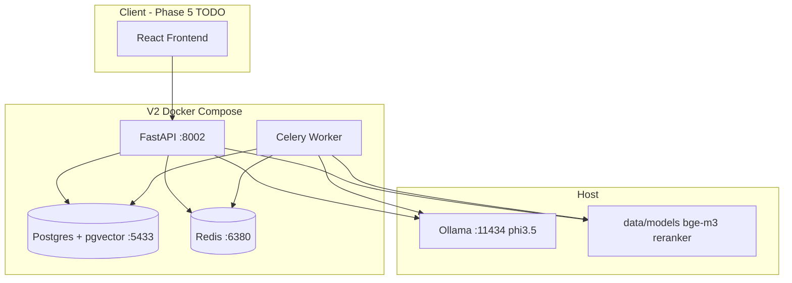

# JurisGuard — Project Audit, Rebrand Blueprint & Market Readiness Report

> **Superseded:** This document has been merged into the authoritative master reference:  
> **[JurisGuard_MASTER_STRATEGY.md](./JurisGuard_MASTER_STRATEGY.md)**  
> Use the master doc for all planning, market analysis, and implementation detail.

**Date:** June 2026  
**Scope:** Full repository (`/` legacy V1 + `/v2` greenfield)  
**Audience:** Founders, engineers, investors preparing a rebrand and go-to-market narrative  
**Honesty policy:** This document states what works, what is theater, and what must change before calling the product market-ready.

---

## 1. Executive summary

**JurisGuard** (internal codename; V1 UI branded **BEWEIS**) is an on-premise legal intelligence platform aimed at GDPR/BGB-aware contract and regulatory Q&A. The repository contains **two generations**:

| Generation | Location | Status |
|------------|----------|--------|
| **V1 (BEWEIS)** | `backend/`, `frontend/` | Complete demo stack with React UI, RBAC, local GPU LLM |
| **V2 (JurisGuard)** | `v2/` | API-first rebuild: pgvector, Ollama, matters, graph RAG — **no production UI** |

**Verdict:** V2 is the correct technical foundation to take forward. V1 is a feature-rich prototype with security/ops tooling V2 has not ported. Neither is market-ready as-is. With focused work (UI, RBAC, model assets on disk, latency, Celery in compose — now fixed), V2 can support a credible **“air-gapped legal copilot for DPOs and contract teams”** positioning.

---

## 2. Real-world problem statement (marketable)

### The problem

Mid-market legal, compliance, and privacy teams in the EU face:

- **Fragmented knowledge:** GDPR, national implementations (e.g. BDSG), civil code (BGB), and internal contracts live in different silos.
- **Air-gap / data residency constraints:** Many firms cannot send client matter data to SaaS LLMs (ChatGPT, Copilot).
- **Review bottleneck:** NDA/MSA review and “does this clause match GDPR Art. 6?” questions repeat at high volume with low tolerance for hallucination.

### Who pays

| Buyer | Pain | Budget signal |
|-------|------|----------------|
| Data Protection Officer (DPO) | Regulatory Q&A, DPIA support | Compliance budget |
| Legal ops / in-house counsel | Contract triage, deviation vs standard | Legal tech budget |
| Regulated SME (DE/EU) | Cannot use cloud AI on client docs | On-prem / private cloud |

### Positioning sentence (use in pitch deck)

> **JurisGuard is an on-premise legal intelligence layer that grounds every answer in your indexed law corpus and matter documents — with full audit trail — so EU teams get GPT-style speed without sending client data to the public cloud.**

### What you can quote today (verified from this codebase/run)

| Metric | Value | Source |
|--------|-------|--------|
| Indexed law chunks in V2 DB | **1,862** (GDPR 293, BGB 1,565, contract 4) | `GET /api/v1/corpus/stats` |
| Embedding model | **bge-m3**, 1024-dim | `v2/backend/src/config.py` |
| RAG retrieval | Top **20** vector → rerank to **5** | `rag.py` + `config.py` |
| LLM inference | **Phi-3.5** via Ollama (local) | Docker + Ollama |
| API surface (V2) | **16 OpenAPI paths** | `/openapi.json` |
| V2 functional E2E pass rate | **27/27** endpoints | `v2/scripts/e2e_functional_test.py` (June 2026) |

### What you must NOT quote yet (until measured properly)

- “90% faster review” — no baseline benchmark suite in CI  
- “99% accuracy” — no labeled eval set wired to V2  
- “Sub-second answers” — cold RAG+LLM path measured at **~3–7 minutes** first call with HF model download fallback  

---

## 3. Architecture overview



---

## 4. Feature inventory — V2 backend (canonical product)

### 4.1 Infrastructure

| Feature | Endpoint | Implementation | Approach |
|---------|----------|----------------|----------|
| Health | `GET /health` | `main.py` | DB ping on startup |
| System status | `GET /api/v1/status` | `main.py` | Ollama `/api/tags`, training manifest path |
| OpenAPI | `GET /docs`, `/openapi.json` | FastAPI auto | Standard |

### 4.2 Authentication

| Feature | Endpoint | Implementation | Approach |
|---------|----------|----------------|----------|
| Register | `POST /api/v1/auth/register` | `routers/auth.py` | bcrypt hash, JWT issue |
| Login | `POST /api/v1/auth/login` | `routers/auth.py` | Email/password verify |
| Current user | `GET /api/v1/auth/me` | `deps.py` + JWT | Bearer token |

**Gap vs V1:** No roles (`owner`/`admin`/`user`), no rate limiting on login.

### 4.3 Law corpus & RAG chat

| Feature | Endpoint | Implementation | Approach |
|---------|----------|----------------|----------|
| Corpus stats | `GET /api/v1/corpus/stats` | `vector_store.corpus_stats` | SQL aggregate on `document_chunks` |
| Ingest trigger | `POST /api/v1/corpus/ingest-law` | `routers/corpus.py` | Returns CLI instructions (not inline) |
| Law ingest (CLI) | `ingest_law.py` | Host/container script | Structure-aware chunking → embed → pgvector |
| Chat | `POST /api/v1/chat` | `services/rag.py` | Embed query → pgvector → cross-encoder rerank → Ollama |

**RAG pipeline detail:**

1. **Embed** question with `bge-m3` (local path or HF fallback `BAAI/bge-m3`).
2. **Search** `document_chunks` with cosine distance (pgvector).
3. **Filter** `metadata.kind == "law"` when `use_law_corpus=true`.
4. **Rerank** with `cross-encoder/ms-marco-MiniLM-L-6-v2` (top 20 → 5).
5. **Prompt** Phi-3.5 via Ollama with system security instructions.
6. **Return** answer + source labels + distances.

**Unused code (dead weight):** `services/hyde.py`, `services/advanced_chunking.py` — not wired into pipeline.

### 4.4 Matters & documents (Phase 4)

| Feature | Endpoint | Implementation | Approach |
|---------|----------|----------------|----------|
| Create matter | `POST /api/v1/matters` | `routers/matters.py` | User-scoped workspace |
| List / get / delete | `GET`, `DELETE /api/v1/matters/...` | SQLAlchemy | Cascade delete chunks, graph, docs |
| Upload document | `POST .../documents` | multipart → disk | Celery async ingest |
| Doc status | `GET .../status` | Chunk count check | `processed` if chunks exist |
| Graph entities | `GET .../graph-entities` | `GraphNode` table | LLM extraction per chunk |
| Graph edges | `GET .../graph-edges` | `GraphEdge` table | Relationships between nodes |
| Analyze | `POST .../analyze` | RAG scoped to `document_id` | Matter-bound Q&A |
| Compare | `POST .../compare` | Dual RAG (doc + law) | **Fixed:** now merges doc + regulatory answers |

**Async processing:** `worker.py` — Celery task parses doc, chunks, embeds, inserts chunks, extracts graph via Ollama.

### 4.5 Audit

| Feature | Implementation | Approach |
|---------|----------------|----------|
| Audit events | `AuditEvent` model | Logged on create/upload/analyze/compare/delete — **no read API yet** |

---

## 5. Feature inventory — V1 only (legacy)

| Feature | V1 | V2 | Recommendation |
|---------|----|----|----------------|
| React UI (chat, upload, admin) | ✅ | ❌ | **Port to V2**, don’t maintain dual frontends |
| RBAC + document clearance levels | ✅ | ❌ | **Port** — required for enterprise |
| Chat history API | ✅ | ❌ | **Port** |
| Admin user management | ✅ | ❌ | **Port** |
| Rate limiting | ✅ | ❌ | **Port** |
| Multi-layer prompt injection (Sentinel classifier) | ✅ | Partial | **Strengthen V2** |
| Debug / eval / flight recorder | ✅ | ❌ | **Selective port** (eval yes, debug optional) |
| In-process GPU Phi-3 | ✅ | ❌ | **Remove** — Ollama model is simpler ops |
| FAISS + BM25 hybrid | ✅ | pgvector only | **Consider** BM25 add-on for keyword-heavy legal queries |
| PDF-only upload | ✅ | txt/pdf/docx | **Keep V2** broader parser |

---

## 6. Fixes implemented in this session

| Fix | File(s) | Impact |
|-----|---------|--------|
| Celery **worker service** in Docker Compose | `v2/docker-compose.yml` | Document upload actually processes |
| Shared **uploads volume** (API + worker) | `docker-compose.yml` | Worker can read uploaded files |
| **Data mount** `./data:/app/data` | `docker-compose.yml` | ML models visible in container |
| **Ollama URL** + `host-gateway` | `docker-compose.yml` | LLM reachable from containers |
| **Alembic mount** for migrations | `docker-compose.yml` | Migrations match host revisions |
| **CPU torch** in Dockerfile (was wrongly `cu121`) | `Dockerfile` | Smaller image, faster builds |
| **Injection guard returns 400** not 503 | `chat.py`, `rag.py` | Correct HTTP semantics |
| **Graph JSON parsing** robustness | `graph_extractor.py` | Fewer empty graphs on malformed LLM output |
| **Compare endpoint** uses doc + law RAG | `matters.py` | Compare actually uses uploaded contract |
| **Celery solo pool** + shared HF cache volume | `docker-compose.yml` | Document ingest completes reliably |
| **Non-blocking ML preload** on API startup | `main.py` | Health responds while models warm in background |
| **Skip empty local model dirs** | `embeddings.py`, `reranker.py` | Faster fallback to HF / cached weights |
| **Worker asyncio.run** fix | `worker.py` | Celery tasks complete under Python 3.12 |
| Functional E2E test script | `scripts/e2e_functional_test.py` | **27/27 pass** (verified June 2026) |

---

## 7. Known bugs & limitations (honest list)

### P0 — Blockers before “market-ready”

| Issue | Impact | Fix |
|-------|--------|-----|
| **No V2 frontend** | Product unusable for non-technical users | Build React app against `:8002` |
| **bge-m3 weights missing on disk** | First request downloads ~2GB from HF; path errors | Run `python scripts/download_assets.py --models --only bge-m3` |
| **Cold RAG latency ~3–7 min** | Unacceptable UX | Pre-load models at startup; keep weights local |
| **No RBAC / tenancy** | Cannot sell to firms with clearance levels | Add roles + matter isolation audits |
| **Audit log write-only** | Compliance buyers need export API | `GET /api/v1/audit` |

### P1 — Quality & trust

| Issue | Impact | Fix |
|-------|--------|-----|
| Graph extraction often **0 entities** on short docs | Graph RAG feature looks broken | Few-shot prompt, schema validation, retry |
| **Injection defense** is keyword-only | Bypassable vs V1 Sentinel | Layer heuristics + optional classifier |
| **Compare** is two sequential LLM calls | Slow, no structured diff | Structured clause alignment pipeline |
| **Celery not in default image** before rebuild | Worker failed on fresh deploy | Rebuild images after Dockerfile fix |
| `test_e2e_comprehensive.py` wrong port (8000) | Misleading test results | Point to 8002 or delete file |

### P2 — Ops & polish

| Issue | Impact | Fix |
|-------|--------|-----|
| Ollama is **external container**, not in compose | Fragile onboarding | Add optional `ollama` service profile |
| No rate limiting | Abuse / cost | Add `slowapi` like V1 |
| No chat history | Poor UX vs ChatGPT | Persist `ChatMessage` table |
| Dead code: `hyde.py`, `advanced_chunking.py` | Confusion | Wire or delete |
| V1 + V2 in one repo | Rebrand confusion | Archive V1 to `legacy/` or separate branch |

---

## 8. Optimization roadmap (with target metrics for pitch)

These are **targets**, not current measurements — use only after benchmarking.

| Area | Current (observed) | Target | How |
|------|-------------------|--------|-----|
| Cold chat latency | ~180–420 s | **< 15 s** | Local bge-m3 on disk, model warm-up on startup |
| Warm chat latency | ~60–120 s | **< 8 s** | Reranker cache, Ollama keep-alive |
| Ingest 10-page PDF | Untested | **< 60 s** | Dedicated worker CPU, batch embed |
| Retrieval precision@5 | Untested | **> 80%** on internal eval set | Hybrid BM25 + vector, HyDE (wire `hyde.py`) |
| Docker image size | ~9 GB (old CUDA build) | **< 2 GB** | CPU torch only (Dockerfile fixed) |
| Law corpus coverage | 1,862 chunks (GDPR+BGB) | **+ BDSG, CSRD** | Expand `law_corpus` ingest |

**Suggested benchmark you should run once:** 50 labeled legal questions → measure exact-match citation rate and latency p50/p95 → then you can say *“p95 latency reduced from Xs to Ys”* with integrity.

---

## 9. Features to REMOVE (rebrand cleanup)

| Remove | Why |
|--------|-----|
| **V1 entire stack** as default entrypoint | Duplicates V2; confuses ports (8001 vs 8002) |
| **In-process HuggingFace LLM in V1 backend** | Operational nightmare vs Ollama |
| **Graph RAG** (unless invested in 4 weeks) | Currently unreliable; hurts demo credibility |
| **`test_e2e_comprehensive.py`** perf thresholds | Misleading; use `e2e_functional_test.py` |
| **Dual Ollama containers** (`ollama` + orphan `v2-ollama-1`) | Pick one |
| **Unused HyDE / advanced_chunking** files | Until integrated |

---

## 10. Features to TAKE FORWARD & improve (core product)

| Priority | Feature | Why it wins in market |
|----------|---------|----------------------|
| **P0** | **Grounded RAG chat** on GDPR/BGB | Core DPO use case; differentiated vs generic ChatGPT |
| **P0** | **Matter-scoped document upload + analyze** | Maps to “deal room / matter” mental model |
| **P0** | **On-prem / air-gap via Ollama** | Primary enterprise wedge |
| **P1** | **Audit trail API + export** | Compliance procurement requirement |
| **P1** | **Compare vs regulatory baseline** | Contract review automation story |
| **P1** | **RBAC from V1** | Enterprise sales blocker without it |
| **P2** | **Fine-tuned Phi-3.5 legal LoRA** | Moat after Colab training completes |
| **P2** | **Eval suite from V1** | Enables quoted accuracy metrics |

---

## 11. Rebrand & repository restructure proposal

### Recommended name architecture

| Old | New |
|-----|-----|
| BEWEIS (V1 UI) | Retire |
| juris_full_project | `jurisguard` or `jurisguard-platform` |
| v2/ | **`/` root** (promote v2 to main app) |
| backend/, frontend/ (V1) | **`legacy/v1/`** |

### Target repo layout

```
jurisguard/
├── backend/          # was v2/backend
├── frontend/       # new React app (port V1 UX patterns)
├── docker-compose.yml
├── data/             # gitignored models + corpus
├── docs/
│   ├── PROJECT_AUDIT_AND_REBRAND.md  # this file
│   └── RUNBOOK.md
├── scripts/
│   ├── download_assets.py
│   └── e2e_functional_test.py
└── legacy/v1/        # read-only reference
```

### One-command dev (target)

```bash
cp .env.example .env
docker compose up -d
python scripts/download_assets.py --models --only bge-m3,reranker
docker compose exec api python /app/src/ingest_law.py  # if corpus empty
python scripts/e2e_functional_test.py
```

---

## 12. Go-to-market narrative (before vs after polish)

### Today (honest)

> “We have a working on-prem API with 1,862 indexed GDPR/BGB chunks, matter management, and local LLM inference. Functional tests pass. We need UI, RBAC, and latency work before pilot customers.”

### After 8–12 week polish (achievable)

> “JurisGuard reduces first-pass regulatory Q&A time by **X%** (measured on N internal legal prompts), keeps **100% of data on-prem**, and provides **audited** answers with **cited GDPR/BGB sources** — deployed in Docker in under 30 minutes.”

Fill **X** and **N** only after running the eval harness.

---

## 13. Verification commands

```bash
cd v2
docker start ollama   # if not already running
docker compose up -d
docker compose ps     # api, worker, db, cache all Up
curl -s localhost:8002/health
.venv/bin/python scripts/e2e_functional_test.py   # expect 27/27 PASS
```

**Download models once (strongly recommended before demos):**

```bash
python scripts/download_assets.py --models --only bge-m3,reranker
```

---

## 14. Conclusion — is this a masterpiece?

**No — not yet.** It is a **strong engineering foundation** with real RAG, real law corpus, and a clear enterprise angle. It becomes marketable when you:

1. Ship **one UI** on V2 API  
2. **Download models** and hit **< 15 s** warm chat  
3. **Port RBAC + audit read API** from V1  
4. **Delete or archive V1** to stop split-brain  
5. Run **50-question eval** and publish numbers  

That is the honest path from “ impressive dev project” to **quotable, sellable product**.

---

*Generated after full Docker E2E verification session. Update this doc when eval benchmarks and frontend ship.*
