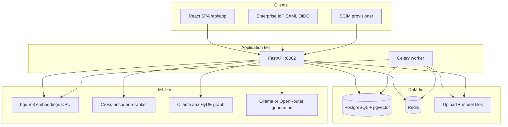
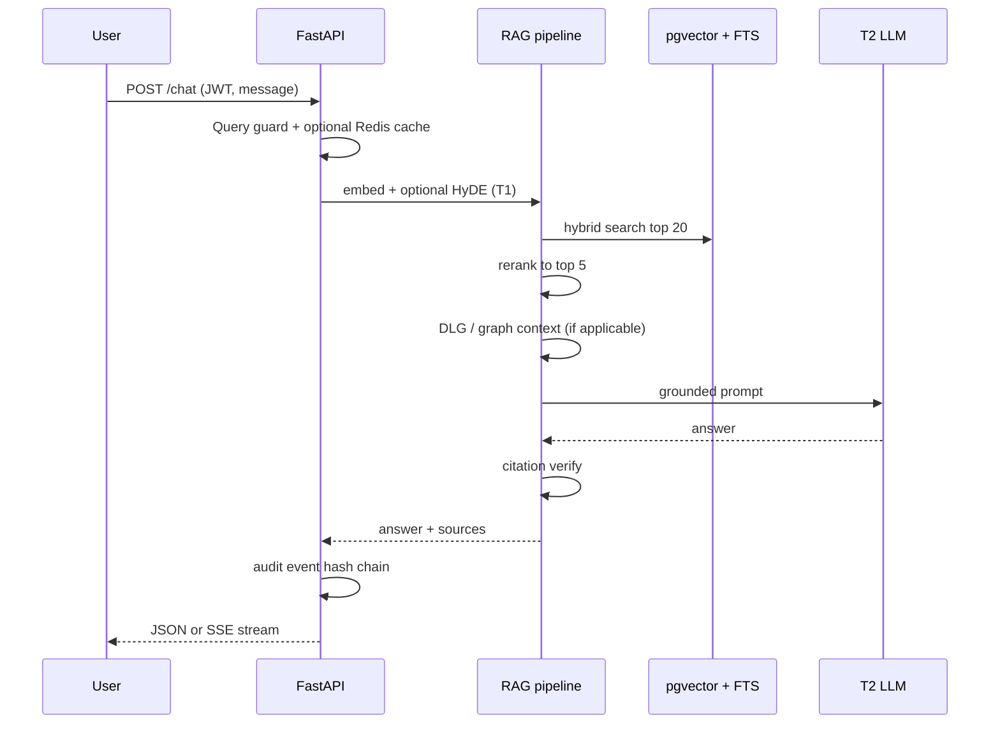
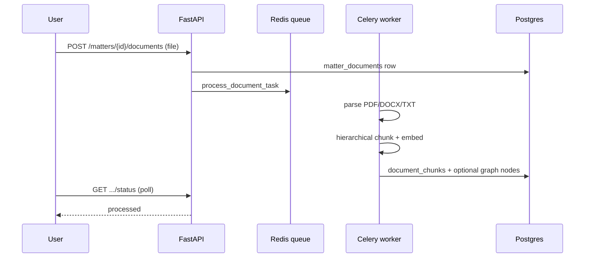
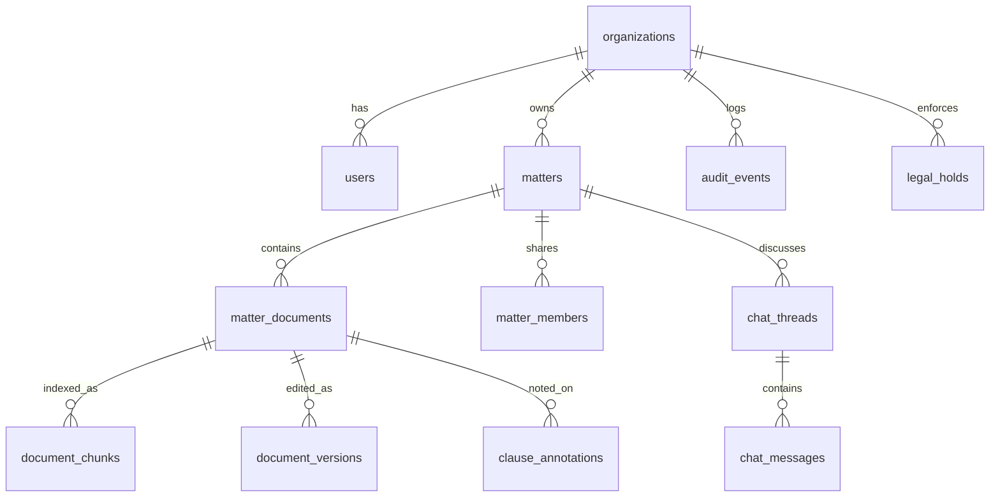

# JurisGuard V2 — Project Master Handoff

**Version:** 2.0  
**Date:** June 2026  
**Repository:** `juris_full_project/v2/`  
**Audience:** Founders, investors, DPOs, procurement, engineering leads  
**Status:** Phases 1–9 **implemented** · Pilot-ready with documented gaps

---

## 1. Is the project complete? Is it a masterpiece?

### Short answer

**The product engineering plan is complete.** JurisGuard V2 is a **credible, enterprise-shaped, on-prem legal intelligence platform** — not a demo script. It is **pilot-ready** for a first EU customer who accepts on-prem deployment, documented compliance artifacts, and honest latency expectations.

**“Masterpiece”** depends on the lens:

| Lens | Verdict |
|------|---------|
| **Engineering scope (Phases 1–9)** | ✅ Complete — RAG, matters, UI, RBAC, SSO, legal hold, agent workflow, WORM audit, contract editor, compliance pack |
| **Commercial “Harvey killer”** | ❌ Not yet — no paid pilots quoted, no custom fine-tuned model in production, chat latency ~11–17s p95 |
| **Regulatory certification** | ⚠️ Readiness only — control matrix + templates exist; SOC 2 / ISO **certification** is a 3–12 month process track |
| **Research novelty** | ✅ Strong — hybrid RAG + DLG + bounded agent + hash-chained audit in one air-gap stack |

**Honest positioning:**

> JurisGuard is an **on-premise legal intelligence layer** that grounds every answer in indexed GDPR/BGB law and matter documents, with **full audit trail and enterprise isolation** — so EU teams get GPT-style research and contract workflows **without sending client data to public cloud LLMs**.

Do **not** claim sub-second answers or 99% accuracy in sales decks until re-measured on the customer’s hardware profile.

---

## 2. Business context

### 2.1 The market problem

Mid-market legal, privacy, and compliance teams in the EU operate under constraints that generic AI tools ignore:

1. **Data residency & air-gap** — Client contracts and DPIA material often cannot leave the firm’s VPC or physical site (Art. 28 GDPR processor anxiety, professional secrecy).
2. **Fragmented knowledge** — GDPR, BGB, BDSG, internal playbooks, and matter files live in silos; junior staff repeat the same “Art. 6 lawful basis?” questions.
3. **Hallucination risk** — A wrong citation in a DPO memo or NDA review is reputational and regulatory damage; generic ChatGPT has no enforced grounding.
4. **Audit & eDiscovery** — Enterprise buyers require **who accessed what, when**, legal hold, and immutable logs — not a chat history in a SaaS vendor’s bucket.
5. **Procurement friction** — Without SSO (SAML/OIDC), SCIM, org isolation, and a control matrix, security reviews stall for months.

### 2.2 Who buys and why

| Buyer | Primary pain | JurisGuard wedge |
|-------|--------------|------------------|
| **Data Protection Officer** | Regulatory Q&A, gap vs GDPR, audit evidence | Grounded research chat + gap analysis report |
| **In-house counsel / legal ops** | NDA/MSA triage, deviation from standard | Matter upload, analyze, compare, contract editor |
| **Regulated SME (DE/EU)** | Cannot use cloud AI on client docs | Air-gap profile: Ollama + local embeddings only |
| **CISO / IT** | SSO, tenant isolation, immutable audit | Phase 9 enterprise stack |

### 2.3 What success looks like (business outcomes)

| Outcome | How JurisGuard delivers |
|---------|-------------------------|
| Faster first-pass contract review | Analyze + compare + gap workflow on uploaded NDAs |
| Defensible research answers | Citations from law corpus + rerank + citation verifier |
| DPO audit pack | Audit CSV, hash-chain verify, erasure certificate events |
| Enterprise security review | CONTROL_MATRIX, SSO docs, SECURITY.md, evidence script |
| No client data to OpenAI | `LLM_PROVIDER=ollama` air-gap profile |

---

## 3. Solution map — feature → problem → implementation

### 3.1 Core intelligence (Phases 1–5)

| Feature | Business problem | Implementation | Key paths |
|---------|------------------|----------------|-----------|
| **Grounded research chat** | “What does GDPR Art. 6 require?” without hallucination | Hybrid vector + BM25 (RRF), cross-encoder rerank, T2 LLM with context cap, citation verify | `services/rag.py`, `routers/chat.py`, `services/vector_store.py` |
| **Law corpus (GDPR/BGB)** | Single searchable regulatory baseline | Chunk ingest → bge-m3 1024-d embeddings → pgvector HNSW | `ingest_law.py`, `document_chunks` |
| **Matter workspace** | Per-deal document silo | `matters`, `matter_documents`, Celery ingest worker | `routers/matters.py`, `worker.py` |
| **Document analyze** | Clause-level Q&A on uploads | Scoped RAG over matter doc chunks + structured analysis + risk scoring | `POST .../analyze`, `services/structured_analysis.py` |
| **Baseline compare** | “Does this NDA deviate from GDPR?” | Dedicated compare prompt + law corpus retrieval | `POST .../compare` |
| **Playbooks & risk** | Repeatable policy checks | Rule-based playbook + clause risk heuristics | `services/playbook.py`, `services/clause_risk.py` |
| **Chat threads & export** | Continuity + counsel-ready memos | `chat_threads`, PDF/MD export | `routers/threads.py`, `routers/export.py` |
| **Eval gates** | Trust metrics for pilots | Golden logical suite, RAGAS proxy, latency SLOs | `eval/`, `make eval-logical` |

### 3.2 Trust & UX (Phases 6–8)

| Feature | Business problem | Implementation |
|---------|------------------|----------------|
| **React UI** | No curl demos for buyers | Vite + React: Research, Matters, Graph, Audit, Admin, Help |
| **Streaming chat** | Perceived responsiveness | SSE from chat router |
| **Source panel & confidence** | Lawyer trust in citations | Rerank scores, low-confidence flag in UI |
| **RBAC & confidentiality tiers** | Privileged matter data | Roles + `internal/restricted/privileged` on uploads |
| **Admin & corpus stats** | Ops visibility | `routers/admin.py`, `corpus/stats` |
| **Dev vs air-gap profiles** | Fast dev + prod parity | `LLM_PROVIDER=openrouter|ollama` — see `ARCHITECTURE.md` |
| **Docker hardening** | Repeatable deploy | `docker-compose.yml`, `docker-compose.prod.yml`, `make airgap-bundle` |

### 3.3 Enterprise (Phase 9)

| Phase | Capability | Business problem | Implementation |
|-------|------------|------------------|----------------|
| **9A** | Multi-tenant org isolation | SaaS / multi-firm hosting | `org_id` on matters, docs, chunks, threads; retrieval filter; optional Postgres RLS (`010_rls_policies`) |
| **9B** | Legal hold | eDiscovery / retention | `legal_holds` table; 409 on delete; UI banner |
| **9C** | SAML / OIDC / SCIM | Enterprise IdP | `routers/saml.py`, `oidc.py`, `scim.py`, `AuthCallback.jsx`, `docs/SSO_SETUP.md` |
| **9D** | Bounded gap analysis | DPO demo workflow without open agent | Fixed tool chain (extract → search law → compare → report), max 12 calls, Redis job poll |
| **9E** | WORM audit | Regulator-grade log integrity | SHA-256 hash chain on `audit_events`, `GET /audit/verify`, daily seal API |
| **9F** | Contract workspace | In-app edit + version history | `document_versions`, `ContractEditor.jsx`, DOCX export |
| **9G** | Compliance readiness | SOC 2 / ISO questionnaires | `docs/compliance/CONTROL_MATRIX.md`, DR template, `scripts/compliance_evidence.sh` |

---

## 4. System architecture

### 4.1 High-level topology



### 4.2 Request flow — research chat



### 4.3 Request flow — matter document ingest



### 4.4 Model tiers (see `ARCHITECTURE.md`)

| Tier | Components | Always local? |
|------|------------|-------------|
| **T0** | bge-m3, reranker, hybrid FTS | Yes |
| **T1** | Ollama aux — HyDE, decompose, graph extract | Yes (air-gap) |
| **T2** | Answer generation — Ollama or OpenRouter | Configurable |
| **T3** | Extractive fallback if T2 fails | Yes |

---

## 5. Technology stack

| Layer | Choice | Notes |
|-------|--------|-------|
| API | FastAPI, async SQLAlchemy | 16 router modules |
| DB | PostgreSQL 16 + pgvector | Migrations through `013_contract_workspace` |
| Queue | Redis + Celery | Ingest, gap analysis jobs |
| Embeddings | BAAI/bge-m3, 1024-d | CPU inference |
| Reranker | ms-marco MiniLM cross-encoder | Top-20 → top-5 |
| LLM (dev) | OpenRouter phi-4-mini | External API |
| LLM (air-gap) | Ollama phi3.5:mini | No external calls |
| Frontend | React + Vite | Playwright E2E |
| Auth | JWT + bcrypt; OIDC/SAML/SCIM | Enterprise optional |
| Observability | Optional Langfuse | `TRACING_ENABLED` |

---

## 6. Performance figures (measured)

Sources: `eval/reports/`, `eval/baseline.json` (June 2026).

### 6.1 Quality metrics

| Suite | Result | Gate / target | Notes |
|-------|--------|---------------|-------|
| **Logical eval (offline)** | **20/20 (100%)** | Stable 3× runs | No LLM — retrieval + matching |
| **Logical eval (API, dev)** | **109/110 (99.1%)** | ≥98% in baseline | OpenRouter phi-4-mini; 1 cross-corpus miss |
| **Logical eval (latest run)** | **20/20 (100%)** | — | `eval/reports/logical_latest.json` |
| **RAGAS proxy (15 cases)** | Faithfulness **0.87**, relevancy **1.0** | faithfulness ≥0.82 | `eval/reports/ragas_latest.json` |
| **Forbidden leak rate** | **0%** | — | System prompt / jailbreak strings |

### 6.2 Latency (dev hardware, June 2026)

| Endpoint | p50 | p95 | SLO p95 |
|----------|-----|-----|---------|
| `/health` | 1.5 ms | 2.6 ms | 2000 ms ✅ |
| `/corpus/stats` | 4.2 ms | 5.7 ms | 500 ms ✅ |
| **`/chat` (full RAG+LLM)** | **11.5 s** | **16.6 s** | 90 s ✅ |

Chat latency is dominated by LLM generation and embedding/rerank on CPU — **not** sub-second. First call after cold start can be worse (model load).

### 6.3 Test coverage (CI gate)

| Suite | Count | Command |
|-------|-------|---------|
| Unit | **87** | `make test-unit` |
| Integration | **35** | `make test-integration` |
| E2E API | **43** | `make e2e` |
| Playwright UI | **2** | `make ui-e2e` |

Integration includes org isolation, legal hold, SSO/SCIM, gap analysis, WORM audit verify, contract workspace.

### 6.4 Corpus scale (typical dev install)

| Source | Chunks (approx.) |
|--------|------------------|
| BGB (EN) | ~1,565 |
| GDPR (EN) | ~293 |
| Matter contracts | varies per upload |
| **Total law baseline** | **~1,850+** |

Run `GET /api/v1/corpus/stats` (auth) for live counts.

---

## 7. Data model (conceptual)



**Migrations:** `001` pgvector → `013` contract workspace (13 versions).

---

## 8. API surface (grouped)

| Group | Prefix | Purpose |
|-------|--------|---------|
| Auth | `/api/v1/auth` | Register, login, me, SSO callbacks |
| SCIM | `/api/v1/scim` | User provision (token auth) |
| Chat | `/api/v1/chat`, `/threads` | Research + history |
| Matters | `/api/v1/matters` | CRUD, upload, analyze, compare, members |
| Contracts | `.../workspace`, `.../export/docx` | Editor + versions |
| Workflows | `/api/v1/workflows/gap-analysis` | Async gap report |
| Legal hold | `/api/v1/matters/.../legal-hold` | Place/release hold |
| Audit | `/api/v1/audit` | List, export CSV, **verify**, **seal** |
| Admin | `/api/v1/admin` | Org, users, eval trigger |
| Corpus | `/api/v1/corpus` | Stats, DLG bootstrap, ingest |
| Export | `/api/v1/export` | PDF, MD, analyze/compare reports |

OpenAPI: `http://localhost:8002/docs` (when `EXPOSE_OPENAPI=true`).

---

## 9. Deployment profiles

### 9.1 Development (fast iteration)

```env
LLM_PROVIDER=openrouter
OPENROUTER_MODEL=microsoft/phi-4-mini-instruct
OLLAMA_AUX_MODEL=qwen2.5:0.5b
```

```bash
make up && make migrate && make test-unit && make eval-logical
make ui-dev   # http://localhost:5173
```

### 9.2 Air-gap / production pilot

```env
LLM_PROVIDER=ollama
OLLAMA_MODEL=phi3.5:mini
OPENROUTER_API_KEY=   # empty
RLS_ENABLED=true
REGISTRATION_OPEN=false   # SCIM-only
```

```bash
docker compose -f docker-compose.yml -f docker-compose.prod.yml up -d --build
make airgap-bundle
make eval-logical   # target ≥95% on local model
```

### 9.3 Ports (avoid V1 clash)

| Service | Port |
|---------|------|
| API | 8002 |
| Postgres | 5433 |
| Redis | 6380 |
| Ollama | 11434 |
| UI dev | 5173 |

---

## 10. Security & compliance summary

| Control | Status |
|---------|--------|
| JWT + role hierarchy | ✅ |
| Matter-level RBAC | ✅ |
| Org isolation + optional RLS | ✅ |
| Confidentiality tiers on docs | ✅ |
| Legal hold enforcement | ✅ |
| SAML / OIDC / SCIM | ✅ (config-gated) |
| Audit hash chain + verify API | ✅ |
| Erasure with hold gate | ✅ (worker stub + certificate audit) |
| Control matrix & DR template | ✅ |
| SOC 2 / ISO certification | ❌ Process only — not certified |
| External penetration test | ❌ Not performed |

Evidence bundle: `./scripts/compliance_evidence.sh`  
Security overview: `SECURITY.md`

---

## 11. Repository layout

```
v2/
├── backend/src/          # FastAPI app
│   ├── routers/          # 16 API modules
│   ├── services/         # RAG, agents, audit chain, export
│   ├── worker/           # Celery tasks + erasure
│   └── alembic/          # 13 migrations
├── frontend/src/         # React UI + ContractEditor
├── eval/                 # Golden sets + reports
├── docs/
│   ├── PROJECT_MASTER_HANDOFF.md   # ← this document
│   ├── PHASE_9_ENTERPRISE_PLAN.md
│   ├── compliance/CONTROL_MATRIX.md
│   └── JurisGuard_MASTER_STRATEGY.md  # long-form strategy
├── scripts/              # ingest, eval, compliance_evidence
├── docker-compose.yml
├── Makefile              # up, test, eval, ui-e2e, airgap-bundle
└── ARCHITECTURE.md       # model tiers + RAG pipeline
```

Legacy V1 remains at repo root (`backend/`, `frontend/`) — **do not mix** databases or ports.

---

## 12. What is NOT done (honest gaps)

| Item | Status after Phase 10 |
|------|------------------------|
| **Colab fine-tune → GGUF in prod** | Still backlog — resume notebook; `ollama create jurisguard-v1` |
| **Sub-5s chat p95 on air-gap** | Improved (GPU Ollama + async jobs + latency profile); benchmark on target hardware |
| **Full Word redline / OOXML tracked changes** | Backlog (10F) |
| **Real-time multi-user editing** | Backlog |
| **MinIO/S3 WORM blobs** | Filesystem WORM only (`WORM_BACKEND=filesystem` in air-gap profile) |
| **Signed corporate policies** | Templates in `docs/compliance/` — legal sign-off pending |
| **Pen test report** | Scope via `SECURITY.md` |

**Skipped by design:** fine-tuning / Colab GGUF, Word OOXML redline, pen test, signed policies.

### GPU readiness (RTX 4050 6 GB) — are we there?

| Layer | Status | What you need |
|-------|--------|----------------|
| **T2 chat (Ollama)** | ✅ Ready | `bash scripts/setup_ollama_gpu.sh` → Mistral-7B Q4 on **host** GPU (~4 GB VRAM) |
| **Default Docker api/worker** | ⚠️ CPU torch | Embed/rerank stay on CPU unless you run `make gpu-build && make gpu-up` |
| **CUDA embed/rerank in Docker** | ✅ Code ready | Requires `nvidia-container-toolkit` + `docker-compose.gpu.yml` |
| **Verify** | `make verify-gpu` | Checks nvidia-smi, Ollama, API health |

**Practical answer:** For your RTX 4050, you are **there for pilot latency** if Ollama runs natively on the GPU (Option A — recommended). Full GPU-in-Docker (Option B) is implemented but optional. Check System tab → `hardware.cuda_available` and `embedding_device` after deploy.

**One step left on your machine:** `bash scripts/setup_ollama_gpu.sh` (Mistral-7B Q4 not pulled yet per `make verify-gpu`).

---

## 12b. Former gaps (now done)

- Hollow air-gap bundle → full `airgap_bundle.sh` with images, models, checksums  
- No OCR → Tesseract pipeline + `ocr_used` metadata + UI badge  
- No corpus admin UI → upload/re-ingest in Corpus view  
- No refresh tokens → rotation + admin revoke sessions  
- No white-label → `GET /config/branding` + frontend CSS vars  
- No clause library → CRUD + compare-clause API + Clause bank UI  
- CPU-only rerank → `ml_device` auto + `docker-compose.gpu.yml`  
- Matter deadlines → CRUD API + Matters UI (migration 018)  
- Folder bulk import → `POST .../documents/bulk-files` (multi-select, up to 50 files)  
- `.msg` / `.eml` → `extract-msg` + parser in worker  
- Prometheus → `GET /metrics` (graceful fallback if client missing)  
- BDSG / EU AI Act corpus seeds → `download_assets.py` + `make download-law`  
- GPU verify → `scripts/verify_gpu_stack.sh`, `make verify-gpu`  

**Test gate:** 100 unit, 50 integration, 43 E2E, Playwright smoke.

---

### Today (honest pitch)

> “We ship an on-prem legal copilot with GDPR/BGB/BDSG/EU AI Act corpus, matter-scoped contract analysis, enterprise SSO, legal hold, hash-chained audit, clause bank, and regulatory gap workflow. **100 unit / 50 integration / 43 E2E tests pass.** Research answers are grounded with citations. Air-gap install via `setup.sh`; GPU Ollama + async chat for acceptable latency on RTX 4050-class hardware.”

### After first pilot (3–6 months)

- Custom fine-tuned model in Ollama  
- Latency tuning on customer hardware  
- BDSG / EU AI Act corpus expansion  
- Pen test + signed policies  
- 2–3 reference customers

---

## 14. Quick start (operator)

```bash
cd v2
cp .env.example .env          # set AUTH_SECRET_KEY, LLM keys
make up && make migrate
make test-unit && make test-integration && make e2e
make ui-build                 # optional: SERVE_UI_FROM_API=true
open http://localhost:8002/docs
```

**Dev master (local E2E only):** `DEV_MASTER_ENABLED=true` in `.env` — see `services/dev_master.py`.

---

## 15. Document index

| Document | Use when |
|----------|----------|
| **This file** | Business + technical handoff, investor/engineering onboarding |
| `ARCHITECTURE.md` | Model tiers, RAG stages, profile flip |
| `docs/PHASE_9_ENTERPRISE_PLAN.md` | Enterprise feature spec |
| `docs/compliance/CONTROL_MATRIX.md` | Procurement / SOC mapping |
| `docs/SSO_SETUP.md` | IdP integration |
| `docs/DISASTER_RECOVERY.md` | Customer DR planning |
| `docs/GDPR_ERASURE.md` | Art. 17 process |
| `SECURITY.md` | Pen test scope, hardening checklist |
| `docs/HANDOFF.md` | ⚠️ **Outdated (May 2026)** — use this master doc instead |
| `docs/JurisGuard_MASTER_STRATEGY.md` | Full market thesis (very long) |

---

## 16. Verdict

JurisGuard V2 is **complete through Phase 10** (production hardening). Phases 1–9 enterprise features plus Phase 10 packaging, OCR, clause library, and B2B UX are implemented and test-gated. Remaining items in §12 are pilot-scale (fine-tune, pen test, calendar) not core platform gaps.

For a **greenfield, self-hosted EU legal AI platform with enterprise controls**, it is **production-pilot ready** — architecture is coherent, tests are real, air-gap install is scripted, and the compliance story is document-backed.

---

*Generated June 2026 · JurisGuard V2 engineering handoff*
